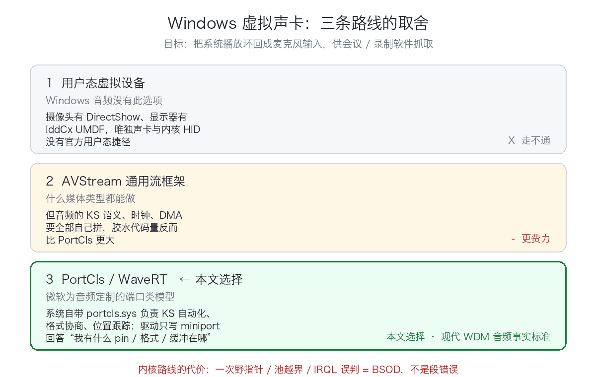
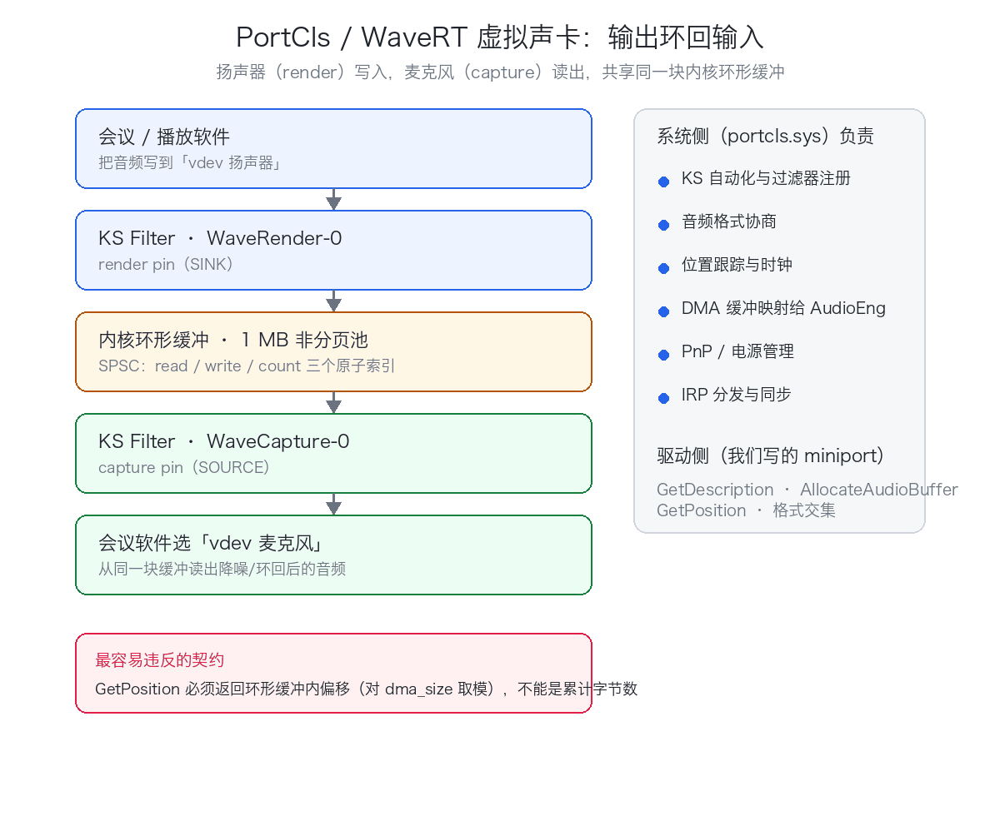

# 用 Rust 把虚拟声卡写进 Windows 内核：六个蓝屏级踩坑与"编译过 ≠ 能跑"

> 本文是 vdev 虚拟设备驱动开发系列之一（共 9 篇）。完整源码与代码位置标注见仓库对应文章。

**一句话：Windows 上想凭空多出一张声卡，音视频四条虚拟设备路线里，只有声卡和内核 HID 必须走内核——这里记录了六个让驱动必蓝屏的真实缺陷。**



> 状态如实说：这个驱动的**构建与门禁全绿、宿主单测全过，但真机安装验证仍在进行中**（PortCls filter 图构建、端点枚举、WASAPI 实录实放还没在真机上跑完）。本文讲的是**怎么把内核驱动写对**，不是"可以拿来用的成品"。

## 一、为什么选了最难走的那条路

想在 Windows 上凭空多出一张声卡（把系统播放环回成麦克风输入，供会议 / 录制软件抓取），大致三条路：

**① 用户态虚拟设备——音频没有这个选项。** 摄像头有 DirectShow 源过滤器（vdev 的 `vdev-camera-win` 走的正是这条路，完全免签名），显示器有 IddCx 的 UMDF 用户态驱动，唯独声卡和内核 HID 没有官方用户态捷径。

**② AVStream 通用流框架——什么都能做，但更费力。** 音频要自己把 KS 语义、时钟、DMA 全部拼起来，音频栈的胶水代码量反而更大。

**③ PortCls / WaveRT——本文的选择。** 微软为音频定制的端口类模型。系统自带 `portcls.sys` 负责 KS 自动化、格式协商、位置跟踪这些"普通话"，驱动只写一个 miniport（小端口）回答"我有什么 pin、什么格式、缓冲区在哪"。现代 WDM 音频驱动的事实标准，微软官方样例 sysvad 就是它。

vdev 的 `vdev-audio-win` 选了第三条，语义上等同 macOS 侧的自研 BlackHole：**虚拟扬声器（render 端点）把系统播放写入环形缓冲，虚拟麦克风（capture 端点）从同一块缓冲读出——输出环回输入。**

**内核路线的代价要提前认清**：任何一次野指针、池越界、错误的 IRQL 假设，代价都不是段错误而是 **BSOD**；内核环境没有 CRT、没有堆抽象、不能 panic 展开，大量用户态习得的"防御性编程"在这里直接失效。下面六个案例全部是独立审查在这个驱动里真实抓出的 blocker——修复前的代码，以当时状态加载几乎必蓝屏。



顺带澄清一处措辞：本文早期草稿沿用设计文档把它称作 "KMDF 内核驱动"，但代码实际**没有用任何 WDF 框架**——手写精简绑定路线，跳过 WDF 的函数表机制，驱动入口直接调 PortCls 的初始化 / 子设备注册函数。它是纯 WDM 风格的 PortCls 小端口驱动。

## 二、读懂 PortCls 只需要五个概念

**1. 适配器驱动骨架。** 驱动的入口不自己填 `DRIVER_OBJECT`，而是交给 PortCls：

```rust
#[unsafe(export_name = "DriverEntry")]
pub unsafe extern "system" fn driver_entry(
    driver_object: PDRIVER_OBJECT,
    registry_path: PUNICODE_STRING,
) -> NTSTATUS {
    unsafe { PcInitializeAdapterDriver(driver_object, registry_path, Some(add_device)) }
}
```

PnP 子系统为设备调 `AddDevice`，我们在里面用 `PcAddAdapterDevice` 注册 StartDevice 回调，并声明子设备对象数上限——本驱动注册 4 个子设备（Wave 捕获/渲染 + Topology 捕获/渲染），所以 `MAX_SUBDEVICES = 4`。这个数必须覆盖**全部**子设备，槽位耗尽后 `PcRegisterSubdevice` 会失败。

**2. 端口 + 小端口 = 子设备。** StartDevice 里按 sysvad 的顺序组装：`PcNewPort(&CLSID_PortWaveRT)` 创建端口对象 → 创建自己的 miniport COM 对象 → 调端口的 `Init`（vtable 第 4 槽）把两者绑在一起 → `PcRegisterSubdevice` 以名字（`WaveRender-0`、`WaveCapture-0`、`TopologyRender-0`、`TopologyCapture-0`）注册成 KS filter。名字必须与 INF 里 `AddInterface` 的模板逐字节一致，仓库有一个宿主单测专门盯这件事。

**3. 过滤器描述符是声明式自描述。** PortCls 启动时调 miniport 的 `GetDescription`，拿一张 `PCFILTER_DESCRIPTOR`：有哪些 pin、数据方向（`KSPIN_DATAFLOW_IN/OUT`）、通信语义（SINK/SOURCE）、pin 类别 GUID（`KSNODETYPE_SPEAKER` / `KSNODETYPE_MICROPHONE`）、支持的格式范围。渲染 pin 声明成 `DataFlow=OUT / Communication=SINK / Category=KSNODETYPE_SPEAKER`，捕获 pin 反之。

**4. WaveRT 是"实时"轮转缓冲。** 传统 WavePci 每个小数据包都触发内核/用户态往返；WaveRT 由 miniport 分配一段物理连续的 DMA 环形缓冲，把用户态地址直接映射给音频引擎，引擎自己搬数据。miniport 只需回答三件事：分配缓冲、硬件延迟、以及最微妙的——**当前播放位置**。

**5. GetPosition 契约。** `GetPosition` 返回的 `PlayOffset` / `WriteOffset` 必须是**环形缓冲内的偏移**（对 `dma_size` 取模），而不是自流开始以来的累计字节数。没有硬件位置寄存器的虚拟设备，应让 `GetPositionRegister` 返回 `STATUS_NOT_SUPPORTED`，PortCls 便会退回"按通知周期反复轮询"的模式。这五个字节的契约，后面会看到我们怎样违反了两次。

## 三、用 Rust 写内核驱动：构建形态与绑定方法论

**双模式 crate。** 整个驱动是一个 crate，靠 feature 切换两种形态：

```rust
#![cfg_attr(feature = "kernel", no_std)]
```

- 默认（无 `kernel`）：普通 cdylib，纯逻辑模块（环形缓冲、位置数学、拓扑描述符、端点常量）无条件编译，`cargo test` 在 macOS 宿主就能跑；
- `--features kernel`：`no_std` 生效，链接 `ntoskrnl` / `portcls` / `ks` 等，产出真正的 `.sys`。

链接脚本设 `/ENTRY:DriverEntry`、`/SUBSYSTEM:NATIVE`、`/DRIVER:WDM`，并用三个 `/NODEFAULTLIB` 排除 `libcmt` / `libucrt` / `libvcruntime`——内核没有用户态 CRT。同时开 `/INTEGRITYCHECK` 强制 PE 校验和。`panic = "abort"`；`no_std` 下的 panic handler 选择很直接：**直接 `KeBugCheckEx(0xDEAD_DEAD, …)`**——内核里 panic 就该干脆地蓝屏，而不是把系统挂在未定义状态。

关于"要不要自己补运行时符号"：如实说，**本驱动没有提供 `memcmp` / `memcpy` 之类的 shim**。`no_std` + `panic=abort` 之后，core 库剩下的链接期依赖只有一个返回 0 的空函数 `__CxxFrameHandler3`，用于满足链接器对 MSVC 异常处理器的引用。

**绑定全部手写，与 WDK 头文件逐字段对照。** 手写的 WDM / PortCls / KS 绑定子集里：`types.rs`（基础类型 + KS/PC 描述符）、`portcls.rs`（导出函数与 IID/CLSID）、`mem.rs`（`ExAllocatePool2` / `ExFreePoolWithTag` 薄封装）、`log.rs`（默认静默的 `kdbg!` 宏，仅接受字面量消息，规避 varargs ABI）。方法论是：vtable 槽序对照 `portcls.h` 行号、GUID 值逐条从 `ksmedia.h` / `ks.h` 抄录并注明行号、结构布局推演 x64 尺寸后用 `size_of!` / `offset_of!` 断言钉死。**宿主跑不了内核代码，但布局断言跑得动**——这是 Rust 内核驱动在非 Windows 开发机上仅有的几种验证手段之一。

## 四、核心机制：三个原子索引 + 时间锚定

### 4.1 SPSC 环形缓冲

扬声器和麦克风两个流共享一块 1 MB 的非分页池（`POOL_FLAG_NON_PAGED`——`GetPosition` 会在 `DISPATCH_LEVEL` 被轮询，任何分页内存都是禁忌）。缓冲本身是无锁 SPSC：裸指针数据区 + `read` / `write` / `count` 三个 `AtomicUsize`，全部 `SeqCst`；数据拷贝先行于 `count` 更新，读者只信 `count`。单写单读 + 原子 RMW 在 x86/ARM64 都安全，`GetPosition` 内无锁、无分页内存、无阻塞调用，DISPATCH_LEVEL 合规。

有个不优雅但诚实的妥协：渲染流满载时 `write_drop_oldest` 会"代写者"推进 read 索引来腾位，所以严格说 read 索引有两个潜在写者——代码注释明说了这是"尽力而为的环回链路，不承诺强一致"。

### 4.2 时间锚定的 GetPosition

虚拟设备没有硬件位置寄存器，位置必须"演"出来，做法与 sysvad 一致：进入 `KSSTATE_RUN` 时记一个 `KeQueryPerformanceCounter` 时间锚点 + 位置锚点；每次被轮询，把流逝的 tick 换算成应推进的字节数，**只处理 `[last_processed, target)` 这一段 DMA 窗口**，且单次推进不超过一个 DMA 周期（防止引擎久未查询时一次搬爆）。

时间→字节、环跨度切分、位置取模这三块纯数学被抽进独立模块，不做任何内核调用、无条件编译——于是这组最容易 off-by-one 的公式反而在 macOS 宿主上有完整单测兜底：

```rust
pub const fn split_ring_span(start: usize, n: usize, size: usize) -> (usize, usize) {
    if size == 0 { return (0, 0); }
    let off = start % size;
    let first = if size - off < n { size - off } else { n };
    (off, first)
}
```

欠载 / 过载策略也在这里：捕获侧读不足就补零（否则 DMA 尾部残留旧数据，麦克风会循环回放陈旧音频）；渲染侧满载就丢最旧数据（丢新数据会让渲染时钟停滞）。

### 4.3 IMiniportTopology：把端点真正"装"进系统

这是同样致命的一课：**只有 Wave 子设备时，设备管理器里能看到声卡，控制面板里却没有播放 / 录音设备**。Windows 音频端点（AudioEndpointBuilder / WASAPI 可枚举的那层）需要每个端点配一个 topology filter，把 Wave 的桥接 pin 连到音量 / 静音终端节点，音频栈才能建成端点。

所以驱动实现了完整的 `IMiniportTopology`：渲染表照抄 sysvad——pin0 自 Wave 汇入、pin1 出至物理扬声器，中间串 VOLUME、MUTE 两个节点；节点挂着真实的 KS 自动化表（`KSPROPERTY_AUDIO_VOLUMELEVEL` 与 `KSPROPERTY_AUDIO_MUTE`），按 `Verb` 分派 GET / SET / BASICSUPPORT 三路。音量 / 静音值用 `AtomicI32` 存内存——**属性语义是真的，DSP 效果是假的**，这对虚拟声卡刚好够用。

最后用 `PcRegisterPhysicalConnection` 把 wave ↔ topology 两对桥接 pin 接成物理连接，任一步失败沿注册逆序 teardown，否则已注册的 port 反向引用即将被释放的适配器内存，是一个窗口期 UAF。

## 五、六个"编译过也必蓝屏"的案例

以下是独立审查在这个驱动里抓出的真实缺陷（修复前的代码），每一个单独拎出来都足以让驱动在设备启动或首次流式传输时 BSOD。它们共性极强：**编译期零报错，错误只在内核里兑现。**

### 案例一：环形缓冲结构体存在栈帧上

最初 `RingBuffer::new` 按值返回结构体，初始化代码把它存在局部变量里，再把**这个栈变量的地址**塞进适配器：

```rust
let ring = RingBuffer::new(ring_mem.cast(), RING_SIZE); // 值，存于栈局部变量
(*this).ring = &ring as *const RingBuffer as *mut RingBuffer; // 栈帧地址！
```

`adapter_init` 一返回，这个指针就是悬垂的。三重后果：`stream_get_position` 在 DISPATCH_LEVEL 经它读写已被复用的内核栈；释放路径对悬垂地址 `ExFreePoolWithTag` 造成池损坏 bugcheck；真正的 1 MB 池分配永久泄漏。

**修法**：把 `RingBuffer` 结构体和数据区合并成**一次**池分配——分配 `size_of::<RingBuffer>() + 1MB`，`ptr::write` 把结构体放置到池基址、数据区紧随其后，释放时只 free 唯一的池指针。

> 教训：内核里任何"会被别的执行流摸到"的对象，生命周期必须挂到池上，栈上构造 + 存地址是标准送命姿势。

### 案例二：回绕首段长度公式写反

环形缓冲写入要切两段：首段从当前写位置到缓冲末尾。最初写成了：

```rust
let first = (w % self.capacity).min(n);                   // 错：首段是"当前偏移"
let first = (self.capacity - w % self.capacity).min(n);   // 对：到末尾的剩余空间
```

前者在 offset 小于半容量时不越界但写错位置（静默数据损坏），跨尾界时直接 slice 越界 panic——内核态就是 `KeBugCheckEx`。

**最扎心的是测试**：修复前仅有的 3 个单测**全部从 offset 0 或恰好容量一半起写**，这个 bug 在宿主上零触发，是审查者用同逻辑写 PoC（容量 8、offset 6、写 4 字节）实证的。修复后补了三类用例：写跨尾界、读跨尾界、整圈回绕，再加一个 4096 步的随机性质测试，环形实现逐字节比对线性参考实现。

> 教训：**回绕逻辑的测试必须从非零偏移、跨尾界的形态开始写**，全零起点的用例天然抓不到这类错。

### 案例三：COM vtable 少一级间接

`IPortWaveRTStream` 是 PortCls 侧的 COM 对象。调用它分配 DMA 页时，最初写成了：

```rust
// 错：把对象本体当 vtable
let vtbl = &*(ps.port_stream as *const c_void as *const IPortWaveRTStreamVtbl);
// 对：COM 对象首字段才是 vtable 指针，必须双重间接
let vtbl: &IPortWaveRTStreamVtbl =
    &*(*(ps.port_stream as *const *const IPortWaveRTStreamVtbl));
```

错的那版把 PortCls 流对象的内部数据当函数指针表，读到一个数据值就"调用"了它——跳任意地址。讽刺的是同一仓库里对另一个 COM 接口的写法是正确的双重间接，两处对照才让问题显形。

> 教训：COM 是"指针的指针"这件事，Rust 的类型系统不替你兜底，只能靠纪律。

### 案例四：GetPosition 的双重契约违反

初版 `stream_get_position` 同时违反了两条契约：每次被轮询都把**整个** DMA 缓冲搬运一遍（PortCls 按通知周期反复轮询，等于每周期重复拷贝同一份数据），并把返回位置累加整缓冲长度、**不取模**——第二个缓冲周期后返回的偏移就越界了，位置跟踪随之错乱。

**修法**：QPC 时间锚点换算目标位置 → 只处理 `[last_processed, target)` 窗口 → `PlayOffset` / `WriteOffset` 一律 `position % dma_size`。

> 这与 macOS 侧踩过的"GetZeroTimeStamp 必须锚定真实流逝时间"是同一族坑：**虚拟设备的时钟不能靠"每次被问就推一段"来演，必须锚定物理时间**，否则轮询频率一变，时钟就跟着变。

### 案例五：NTSTATUS 手算十进制错

绑定层的 NTSTATUS 常量最初是手算的十进制补码值，7 个常量错了 5 个。最致命的一个：

- 注释声称 `STATUS_BUFFER_TOO_SMALL` = `0xC0000023`
- 实际写成 **`0xC000000D`**
- 正确值 `0xC0000023`

`STATUS_BUFFER_TOO_SMALL` 是 KS 数据交集协议里"第一次给 NULL 缓冲查尺寸"的**约定返回值**（本驱动就靠它走两段式查询）。写成 `0xC000000D`（恰好是 `STATUS_INVALID_PARAMETER` 的值），PortCls 把尺寸查询当硬错误——pin 格式协商直接失败，而且**没有任何日志**，流就是建不起来。

**修法分三层**：一律改十六进制字面量直书后转型（`0xC000_0023u32 as i32`，"回绕即本意"）；`const _: () = assert!(...)` 编译期钉死"错误级 NTSTATUS 转 i32 必为负"这一不变式；再加逐常量比对官方值的回归测试。

> 教训：**常量值永远抄 hex，不要心算补码。**

（说明：本案例"7 个错 5 个"是对当时原始错误值的描述，该版本已被修复覆盖、无法逐值复核；可复核的是当前代码与那组断言 / 回归测试。）

### 案例六：KS 描述符凭记忆写布局

最初的 `KSPIN_DESCRIPTOR` 凭记忆书写：漏了 `DataFlow` 字段、`Category` / `Name` 按值内嵌 GUID（真布局是 `*const GUID` 指针）、字段顺序错位。PortCls 按真 ABI 在固定偏移读 `Category` 指针时，读到的是 GUID 值的前 8 字节——`KSCATEGORY_AUDIO` 开头是 `0x6994AD04`，**一个非规范地址，解引用即蓝屏**。`PCPIN_DESCRIPTOR` 的层次也写错，`PCFILTER_DESCRIPTOR` 更是杜撰出了不存在的 `ConnectionSize` 和尾部 5 个 GUID 字段。

另外同一批还有一处"抄写错"：`IID_IMiniport` / `IID_IPort` 曾被错写成完全不相干的 GUID 值，PortCls 以真 IID 查询会拿到 `E_NOINTERFACE`。连音频主格式 GUID `KSDATAFORMAT_TYPE_AUDIO`（即小端的 `'aud '`）都曾是个杜撰值——格式协商从第一字节的字节序起就得对。

**修法没有捷径**：下载对应版本 WDK 的头文件，逐字段推演 x64 布局（ULONG 4B、指针 8B、C 枚举 4B、匿名联合写全变体撑起真实尺寸——`KSPIN_DESCRIPTOR` 尾部那个联合的第二变体恰好把结构撑到 88 字节，省略它整体短 16 字节会被 `GetDescription` 拒收），重写后每个结构配布局断言：

```rust
#[test]
fn ks_pin_descriptor_layout_x64() {
    assert_eq!(size_of::<KSPIN_DESCRIPTOR_TAIL>(), 16);
    assert_eq!(size_of::<KSPIN_DESCRIPTOR>(), 88);
    assert_eq!(offset_of!(KSPIN_DESCRIPTOR, DataFlow), 48);
    assert_eq!(offset_of!(KSPIN_DESCRIPTOR, Category), 56);
    assert_eq!(offset_of!(KSPIN_DESCRIPTOR, Reserved), 72);
}
```

> 一句话沉淀：**内核 / COM 的 ABI 结构与常量，权威只有 WDK 头文件；一律"头文件 + 布局断言"双保险，禁止凭记忆。**

**同批修复的两个小案例**：`PcAddAdapterDevice` 绑定少写了一个参数，x64 调用约定下第 6 参从栈上未初始化槽位读入野值；无硬件位置寄存器时 `GetPositionRegister` 曾返回 `STATUS_SUCCESS` + 空寄存器，可能诱使 PortCls 进入寄存器模式对地址 0 做 MMIO 读——改为返回 `STATUS_NOT_SUPPORTED` 退回轮询模式。

## 六、构建与安装

前置：Windows 机器 + Visual Studio 2022（C++ 桌面负载）+ WDK 10.0.26100 + Rust stable（MSVC target）。`crates/vdev-audio-win` 是独立 workspace。

```powershell
# 产出内核驱动（kernel feature 打开 no_std + 内核链接）
cargo build --release --features kernel -p vdev-audio-driver

# 打包 + 签名：改名为 vdev_audio.sys，连 INF/CLI 拷入 target\dist，
# Inf2Cat 生成 vdev-audio.cat，signtool 用证书 Subject 签 sys 和 cat
.\scripts\stage-sign-audio.ps1
```

**签名现状必须如实说**：这是自签名 / 测试签名路线。先用 `New-SelfSignedCertificate -Type CodeSigningCert` 做一张代码签名证书，`certutil -addstore` 装进 TrustedPublisher 和 Root；若加载仍被拦，开测试签名（`bcdedit /set testsigning on`，需重启）。签名脚本里 signtool 的 `/n` 参数直接取查到证书的 `$cert.Subject`——这个脚本曾被从显示驱动复制过来、证书名硬编码错配，也是审查修掉的点之一。

安装走 CLI（自动 UAC 提权，参数转义处理了含空格路径）：

```text
vdev-audio-win.exe install --inf-dir target\dist   # 装驱动（需管理员）
vdev-audio-win.exe status                          # 查看安装状态
vdev-audio-win.exe uninstall                       # 卸载
```

INF 是 Media 类、`Root\vdev-audio` 硬件 ID。有个值得单独说的细节：**INF 必须是 UTF-16 LE（带 BOM）**——SetupAPI 只认这个编码，仓库的宿主单测会读 INF 字节流校验 BOM、CRLF 行尾，以及四个接口模板与驱动里注册名逐字节一致（这个 INF 曾是 UTF-8 + 双 BOM，还是审查抓出来的）。

## 七、现状与局限

如实交底：

- **构建与门禁全绿，真机验证仍在进行中。** 交叉编译通过、宿主单测（环形缓冲性质测试、布局断言、描述符一致性、GUID 字节比对、INF 编码契约）全部通过；但 PortCls filter 图构建、端点枚举、WASAPI 实录实放这些运行时行为，只能装到开了测试签名的真机上验证，这一步尚未完成。
- **格式固定**：48 kHz / 16 bit / 双声道 PCM，`stream_set_format` 硬校验，别的不收。
- **位置走轮询**：无硬件位置寄存器（修复后明确返回 `STATUS_NOT_SUPPORTED`），依赖 PortCls 的轮询模式 + QPC 时间锚。
- **音量 / 静音是"记事本"**：topology 节点属性真实可读写，但没有 DSP 效果。
- **没有用户态注入接口**：环回纯内核内完成，驱动没有任何 IOCTL / WriteFile 面（安全面上是干净的，但"宿主程序直接往环形缓冲注音"目前做不到）。

## 写在最后：内核驱动"编译过 ≠ 能跑"

这个驱动的六次蓝屏级缺陷，**没有一个是编译器能抓的**：栈悬垂是合法的裸指针运算，回绕公式错是合法的下标，vtable 少一级间接是合法的转型，NTSTATUS 错值是合法的 i32，KS 描述符错布局是合法的 `repr(C)`。`unsafe` 的自由把类型系统的保护全部让渡给了 ABI——而 ABI 的权威不在任何一门语言里，只在 WDK 头文件和官方样例里。

方法论的沉淀就三条：

1. **官方样例与 WDK 头文件是唯一权威。** sysvad 的安装顺序、连接表条目、端点拓扑，逐行照抄不丢人；结构布局、GUID、NTSTATUS、vtable 槽序，逐字段对照头文件，注释里写明行号来源。
2. **把"内核才能验证的"压缩到最小，其余全部下沉为宿主可测。** 纯数学抽模块、纯常量抽模块、布局断言进 `#[cfg(test)]`——本驱动最终有 6 个驱动测试模块（含 CLI 共 7 个）可以在 macOS 宿主跑，其中两个（回绕性质测试、NTSTATUS / GUID 值回归）正是案例二和案例五的疫苗。
3. **装上 Driver Verifier 再上真机。** special pool + DDI compliance 会把池越界和 IRQL 违规在第一时间变成可定位的 bugcheck，而不是等池损坏在别处爆炸。

> 内核驱动的世界没有"先跑起来再说"。每一个凭记忆写出的字节，最终都会以蓝屏的形式找你复核。

---

**关于 vdev**：一个用 Rust 造虚拟设备的开源项目（摄像头 / 显示器 / 声卡 / HID，macOS + Windows 双栈），本系列共 9 篇，全部基于仓库真实代码与真实排障记录。

- 项目地址：**github.com/gqf2008/vdev**（点击文末"阅读原文"）
- 本文源码：`crates/vdev-audio-win`
- 参考实现：Microsoft sysvad 官方样例

如果这篇帮你避开了一次蓝屏，欢迎到仓库点个 star，或在 issue 区聊聊你的内核踩坑经历。
