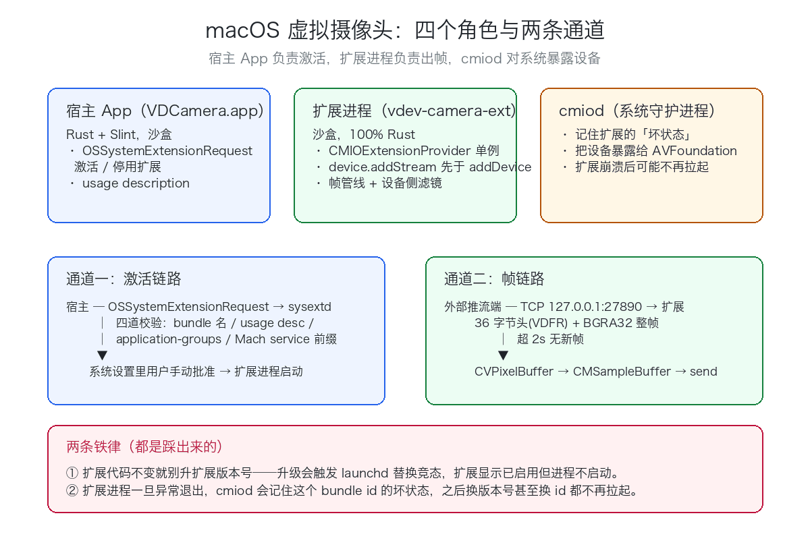

# 用 100% Rust 写 macOS 虚拟摄像头：CMIOExtension 从激活到出帧

**macOS 上造虚拟摄像头，现代路线只有 CMIOExtension 一条；这个项目连 Swift 壳都没要，用 100% Rust 把 provider 直接实现出来。**

> 本文是 vdev 虚拟设备驱动开发系列之一（共 9 篇）。完整源码与代码位置标注见仓库对应文章。

## 1. 为什么要造虚拟摄像头，以及为什么 DAL 已经死了

虚拟摄像头是"软件造设备"里最有意思的一类：把屏幕画面、视频文件、AI 生成的影像注入一个系统级摄像头设备，让 QuickTime、Zoom、腾讯会议把它当真硬件选。OBS 的虚拟摄像头、OBS-VirtualCam、各种"美颜相机"桌面版，底层都是这一招。

在 macOS 上，这条路在最近几年被苹果整个换掉了。老方案是 CoreMediaIO **DAL 插件**（`PlugInMain` 入口的 bundle 插件，加载进每个客户端进程）：vdev 仓库早期实现过一版，插件能构建、能签名、手动 `dlopen` 调 `PlugInMain` 也能拿到有效接口指针——但 `cameracaptured`/AVFoundation/CMIO 的设备枚举就是不加载它。排查签名、权限、UUID、安装路径逐一排除后，结论很干脆：**DAL 插件机制自 macOS 12.3 起被弃用，macOS 13+ 由 CMIOExtension（Camera Extensions）取代**，新系统对第三方 DAL 插件已停止加载。OBS 在 macOS 13+ 也是整体切换到 CMIOExtension 的（obsproject/obs-studio#7777）。

所以现代路线只有一个：写一个 **System Extension**，在里面用 `CMIOExtensionProvider` / `CMIOExtensionDevice` / `CMIOExtensionStream` 三个对象把摄像头"登记"给系统，由 `cmiod` 这个系统守护进程代为对外暴露。代价是：

- 扩展必须装在一个 App bundle 里（`Contents/Library/SystemExtensions/` 下），要真签名，还要用户去系统设置手动批准；
- 扩展进程是沙盒的，`NSLog` 都可能不进 unified log，调试比普通进程难一档。

vdev 的实现（`vdev-camera` + `vdev-camera-ext` + 宿主 `vdev-app`）在 macOS 26.5（Apple Silicon）上实测可用：QuickTime/会议软件可见 `vdev-camera`，1920x1080@60 出帧稳定。下面把整条链路拆开讲。

## 2. 技术选型：为什么是 100% Rust + 手写 objc2 绑定

做 CMIOExtension 的项目几乎都是 Swift 或 ObjC——苹果的示例、社区项目（如 daily-virtual-camera）全是。vdev 最终选择了 **100% Rust：零 Swift、零 xcodebuild**，绑定量手写。这是刻意为之的取舍：

- **一致性**。vdev 全仓库（HID/屏幕/声卡/摄像头，macOS + Windows 十几个 crate）都是 Rust，如果摄像头这一处引入 Swift 壳，就多一门语言、一套构建体系（xcodebuild/XcodeGen/project.yml）和一条 CI 流水线。早期版本确实有 Swift 扩展壳，后来在 commit `202b268`（"CMIOExtension 正式迁移到 100% Rust——零 Swift，无 xcodebuild"）整体替换，`2248a19` 删掉了旧壳。
- **边界其实很薄**。真正需要绑定的只有三块：三个 `CMIOExtension*Source` 协议（ObjC 方法回调）、SystemExtensions 的激活委托、CoreVideo/CoreMedia 的 C 函数（`CVPixelBufferCreate`、`CMSampleBufferCreateForImageBuffer` 等）。C 函数部分直接 `extern "C"` 声明即可，根本不需要绑定生成器；ObjC 部分用 objc2 0.6 的 `extern_protocol!` + `define_class!` 手写，总量不到两百行（见 `crates/vdev-camera-ext/src/cmio.rs`，165 行）。
- **代价是什么**。内存管理语义（+0/+1、autorelease）要自己背，ObjC 异常要自己拦，`msg_send!` 没有类型检查。这些坑本文第 5 节都会讲到。如果你是单人项目、只做摄像头一个设备，Swift 薄壳 + Rust 静态库（C ABI 出帧，`crates/vdev-camera/src/cabi.rs` 就是为此设计的）是更省力的组合；如果你要维护一整套虚拟设备，统一语言的红利会盖过绑定成本。

顺带一提：`CMIOExtensionProviderSource` / `DeviceSource` / `StreamSource` 这三个"协议"**在 ObjC 运行时里并不存在**——它们是 Swift 协议，`class_addProtocol` 会静默失败。但框架实际按 selector 派发消息，只要类上存在同名方法实现就能工作。所以 objc2 的 `extern_protocol!` 声明只是给 Rust 侧的类型安全用的，不必（也不能）让运行时真正 conform。

## 3. 架构与数据流

整体三个角色：

`
宿主 App（VDCamera.app，Rust + Slint，crates/vdev-app）
 │ OSSystemExtensionRequest 激活/停用（sysext.rs）
 │ FrameClient 推帧（TCP 127.0.0.1:27890）
 ▼
扩展进程 vdev-camera-ext（沙盒，crates/vdev-camera-ext）
 │ FrameChannel 收帧 → INJECTED 槽（只留最新一帧）
 │ frame_loop：有新鲜帧发注入帧，否则回落彩条
 │ send_bgra：CVPixelBuffer → CMSampleBuffer → [stream sendSampleBuffer:]
 ▼
cmiod（系统守护进程）→ AVFoundation → QuickTime / Zoom / …
`

### 3.1 帧通道协议

宿主（或任何外部工具）与扩展之间的帧协议是自定义的 36 字节小端头 + BGRA32 payload，定义在 `crates/vdev-camera-ext/src/frame_channel.rs`：

`
offset size 字段
0 4 magic = 0x56444652 ("VDFR")
4 4 version = 1
8 4 width (u32, ≤ 7680)
12 4 height (u32, ≤ 7680)
16 4 stride (u32, w*4 ≤ stride ≤ w*4+8192，允许行尾填充)
20 8 ptsNs (u64, 纳秒时间戳)
28 8 payloadLen (u64, 必须 == stride*height，且 ≤ 256MiB)
36 ... BGRA32 整帧
`

常量与校验入口在 `frame_channel.rs` 的 `parse_header`。发送侧的对称实现在 `frame.rs` 的 `FrameClient::send_frame`，两侧字段一一对应。扩展侧每个连接只保留**最新一帧**（`INJECTED` 静态槽），这与虚拟摄像头的语义天然匹配——消费端永远只要"当前画面"，不消费历史。

通道有三个防御性设计，都是被真实 bug 教出来的：

1. **头字段全部钳制**：宽高 ≤ 8K、stride 允许 `w*4` 到 `w*4+8KiB` 的填充、单帧 ≤ 256MiB。早期版本 `stride < w * 4` 用 u32 乘法，`w ≥ 2^30` 时 release 下回绕（`w=2^30+1 → w*4=4`）可以直接绕过校验；现在所有乘法与比较都在 u64 域做，并有 `width_overflow_wrap_attack_rejected` 单测钉死。
2. **协议违规立即断连**：头校验不过就 `return` 关连接。此前是 `break` 只跳出内层循环，脏的 36 字节永远不被 drain，`pending` 缓冲无界堆积——一个 OOM 面。
3. **新连接接管**：新客户端 accept 时对旧 socket `shutdown(Both)`，旧连接的读线程随读失败退出。否则两个推流端会交替覆盖 `INJECTED` 槽，画面闪烁。

### 3.2 扩展内的帧管线

`main`按 8 步线性初始化：建 `CMVideoFormatDescription`（1920x1080 BGRA@60）→ 建 `CMIOExtensionStreamFormat` → 建三个 source 对象 → 建 `CMIOExtensionStream` → 建 `CMIOExtensionDevice` → 建 `CMIOExtensionProvider`（`clientQueue` 必须给真实 dispatch queue，NULL 会注册不上 XPC）→ **先 `addStream` 再 `addDevice`** → 起帧线程、`startServiceWithProvider`、进 `CFRunLoopRun`。

帧线程 `frame_loop`用 `Pacer` 按**固定 deadline 节拍**（60fps，只补足到下一个 tick）循环：`streamingClients` 非空（还有客户端在拉流）时才产帧——先看 `INJECTED` 槽里有没有 2 秒内的注入帧——有就走滤镜（可选）直发；没有就调用核心库的 `vdev_camera_render_bgra32` 渲染一帧 SMPTE 彩条发出去。也就是说**摄像头永不黑屏**：没有推流源时它是一个彩条测试源，这正是验证链路时最有用的行为。

彩条回落窗口为什么是 2 秒？因为推流端可能"喘"：读网络挂载的视频、屏幕静止不产生新帧，都会让注入停顿。停顿小于窗口时靠推流端保活（重发最后一帧）顶住，超过窗口才回落彩条——这套"保持注入新鲜"的机制让画面在源停顿时也不闪彩条。

## 4. 关键实现解析

### 4.1 手写 CMIO ObjC 绑定：协议声明与属性常量

三个 source 协议用手写 `extern_protocol!` 声明（，StreamSource 节选）：

`rust
extern_protocol!(
 pub unsafe trait CMIOExtensionStreamSource: NSObjectProtocol {
 #[unsafe(method(formats))]
 unsafe fn formats(&self) -> Retained<NSArray<NSObject>>;

 #[unsafe(method(authorizedToStartStreamForClient:))]
 unsafe fn authorizedToStartStreamForClient(&self, client: &NSObject) -> bool;

 #[unsafe(method(startStreamAndReturnError:))]
 unsafe fn startStreamAndReturnError(&self, outError: *mut *mut NSObject) -> bool;

 #[unsafe(method(stopStreamAndReturnError:))]
 unsafe fn stopStreamAndReturnError(&self, outError: *mut *mut NSObject) -> bool;
 // … availableProperties / streamProperties… / setStreamProperties…
 }
);
`

方法签名逐字对照 `CMIOExtension*.h` 头文件，`#[unsafe(method(...))]` 保证 selector 拼写编译期即正确。实现侧用 `define_class!` 挂到自定义类上（ 的 `VdevRustProviderSource` 等），返回对象的方法用 `method_id` 处理。

另一个容易翻车的点是**属性常量**。`availableProperties` 要返回 `CMIOExtensionPropertyProviderName` 这类 `NSString*` 全局常量的集合，字符串字面值无从得知（猜错就静默不工作）。正确姿势是运行时从 framework 里取：

`rust
fn cmio_handle -> *mut c_void {
 let p = CMIO_HANDLE.get_or_init(|| unsafe {
 dlopen(c"/System/Library/Frameworks/CoreMediaIO.framework/CoreMediaIO".as_ptr, 2)
 });
 *p as *mut c_void
}

pub fn property_const(name: &str) -> Retained<NSString> {
 let sym = std::ffi::CString::new(name).expect("symbol no NUL");
 let sym_addr = unsafe { dlsym(cmio_handle, sym.as_ptr) };
 assert!(!sym_addr.is_null, "dlsym 找不到 {name}");
 // dlsym 返回的是全局变量（NSString* const）的地址，要先解引用拿对象指针
 let obj_ptr = unsafe { *(sym_addr as *const *const std::ffi::c_void) };
 let ns = obj_ptr.cast::<NSString>;
 // 全局常量对象，retain 一份保证 Rust 侧生命周期安全
 unsafe { Retained::retain(ns.cast_mut).unwrap }
}
`

这里的 `dlopen` 与"先解引用再 retain"分别踩过坑，见第 5 节。

### 4.2 系统扩展的激活与用户批准

扩展自己不能激活自己，必须由一个普通 App 向 `OSSystemExtensionManager` 提交请求。宿主 App 的封装在：objc2 `define_class!` 实现 `OSSystemExtensionRequestDelegate` 的四个回调——替换策略（返回 `1` = Replace）、需要用户批准、完成、失败。

`rust
#[unsafe(method(requestNeedsUserApproval:))]
fn needs_approval(&self, _req: &AnyObject) {
 fire(SysextEvent::NeedsApproval);
}

#[unsafe(method(request:didFailWithError:))]
fn did_fail(&self, _req: &AnyObject, error: &AnyObject) {
 fire(SysextEvent::Failed(error_description(error)));
}
`

提交本身是纯消息发送：`activationRequestForExtension:queue:` → `setDelegate:` → `submitRequest:`（ 的 `submit`）。批准入口在 macOS 26 是 **系统设置 → 通用 → 登录项与扩展 → 扩展 → 按类别 → 相机扩展**。仓库里还有一个最小宿主 `vdev-spike-host`（`crates/vdev-camera-ext/src/host.rs`），专职激活/停用扩展做对照实验，支持 `--deactivate`——注意停用必须走 `deactivationRequestForExtension:queue:`，早期版本无条件提交激活请求，`--deactivate` 只影响了打印文案，实际从未停用（ 的注释原话）。

回调队列也有讲究：delegate 回调落在串行 dispatch queue 上，队列必须进程生命周期持有（，`mem::forget` 兜底）；回调里如果锁中毒再 panic，会跨 ObjC trampoline 直接 abort，所以所有锁都按 `unwrap_or_else(PoisonError::into_inner)` 抗中毒访问。

### 4.3 出帧：CVPixelBuffer → CMSampleBuffer → sendSampleBuffer

每帧的发送在 `send_bgra`：`CVPixelBufferCreate`（带 `IOSurfaceProperties` 属性）→ lock → 拷贝 BGRA → unlock → `CMSampleBufferCreateForImageBuffer` 打包时间戳 → `[stream sendSampleBuffer:discontinuity:hostTimeInNanoseconds:]` → 释放。有两个细节值得展开。

其一是 **stride 处理**。协议允许推流方带行尾填充，而 CoreVideo 分配的像素缓冲行距（`CVPixelBufferGetBytesPerRow`）未必等于 `w*4`，两侧都可能不齐：

`rust
fn copy_bgra_rows(dst: &mut [u8], src: &[u8], w: u32, h: u32, stride: u32, dst_stride: usize) {
 let valid = w as usize * 4;
 if valid == 0 {
 return;
 }
 let row_bytes = valid.min(stride as usize).min(dst_stride);
 for row in 0..h as usize {
 let s = row * stride as usize;
 let d = row * dst_stride;
 dst[d..d + row_bytes].copy_from_slice(&src[s..s + row_bytes]);
 }
}
`

只拷每行前 `w*4` 有效字节、行内长度再与两个 stride 取 min——此前按整行拷贝，推流方发 padded stride 且 CV 分配的 `dst_stride = w*4` 时，最后一行索引越界 panic（每帧黑屏 + 日志刷屏）。现在四个方向的单测都在。

其二是 **C 对象的 Copy 规则**：`CMSampleBufferCreateForImageBuffer` 与 `CVPixelBufferCreate` 都是 Create 规则（返回 +1），发送完要各 `CFRelease` 一次（`crates/vdev-camera-ext/src/main.rs`）；`streamPropertiesForProperties:error:` 里 `CMTimeCopyAsDictionary` 返回的字典也是 +1，`setFrameDuration:` 内部已 retain，所以取完同样要释放自己的那份，否则每次读取流属性泄漏一个字典（ 的 SAFETY 注释写明了这条规则）。哪次该释放、哪次严禁释放，全看返回规则是 Copy/Create 还是 get——第 5 节有个反例。

### 4.4 异常与 panic 的三道边界

扩展进程一旦消失，`cmiod` 会记住这个 bundle id 的坏状态，之后连进程都不再拉起（详见第 5 节）。所以 vdev 给帧链路设了三道边界：

1. **ObjC 异常**：`sendSampleBuffer:` 在流被外部停止等时机会抛 NSException，Rust 没有 exception 边界，逃逸即 `___rust_foreign_exception` abort。发送处用 `objc2::exception::catch` 包住，异常只记日志；
2. **Rust panic**：整个帧循环体包 `catch_unwind`，配合 `std::panic::set_hook` 把 panic 写进日志，循环继续跑下一帧；
3. **日志通道**：沙盒扩展写文件不可靠、`NSLog` 不进 unified log，所以扩展自带一个 TCP 日志口（`127.0.0.1:27891`， 的 `log_server`）+ 多路径落盘兜底（App Group 容器 → `$HOME` → `/tmp` → `/var/tmp`，）。进程一启动就把日志服务拉起来——"任何提前退出都能看到"。

## 5. 踩坑实录

以下五条全部来自真实排障过程（修复史即踩坑史，`git log -- crates/vdev-camera crates/vdev-camera-ext` 可复核）。

### 坑 1：dlsym 在共享缓存下找不到符号，找到了也不能直接用

**现象**：`dlsym(RTLD_DEFAULT, "CMIOExtensionPropertyProviderName")` 返回 NULL；换成能找到的写法后，扩展一取属性就 SIGBUS（KERN_PROTECTION_FAILURE）。

**定位**：macOS 的系统 framework 都在 dyld 共享缓存里，`RTLD_DEFAULT` 查不到它们的符号，必须先 `dlopen` framework 拿句柄再 `dlsym`（即 4.1 节的 `cmio_handle`）。SIGBUS 则是因为 `dlsym` 返回的是**全局变量的地址**（`NSString* const` 的地址），直接强转成对象指针等于把"指针的指针"当对象用——要先解引用一次取出真正的 `NSString*`。

**修法**： 的 `property_const`：dlopen 句柄 → dlsym → `*(ptr as *const *const c_void)` 解引用 → `Retained::retain` 接管。retain 这一步不能省：全局常量对象虽不会被释放，但让 Rust 侧持有明确的 +1 语义才能用 `Retained` 管生命周期。

### 坑 2：ObjC 异常逃逸 → abort → cmiod 把扩展标记为"坏"，再也不拉起

**现象**：扩展激活成功但进程不启动；排查发现早期是"启动即死"——在 `main` 主路径加的诊断代码（`conformsToProtocol:` 等）触发 ObjC 异常，Rust 无异常边界，`___rust_foreign_exception` abort。最恶心的是后续：**cmiod 把这个 bundle id 记为坏状态，之后换版本号、甚至换新 bundle id 都不再拉起进程**，直到用户从系统设置删掉该扩展重新激活（或重启）。

**定位**：崩溃报告在 `~/Library/Logs/DiagnosticReports/*.ips`，看到 `___rust_foreign_exception` 即实锤。

**修法**：三道边界（见 4.4）——诊断代码不进 main 主路径；所有跨 FFI 的 ObjC 调用按需包 `objc2::exception::catch`；帧循环包 `catch_unwind`；配套 TCP 日志口保证"启动即死"能看到最后一行日志。对应 commit `333de1b`（"扩展崩溃加固——sendSampleBuffer 包 ObjC 异常、帧循环 catch_unwind、彩条缓冲复用"）。

### 坑 3：激活校验四连拒，以及 launchd 替换竞态

激活阶段 sysextd 的报错是逐层校验的，每一层都是独立的坑（错误原文要用 `log show --predicate 'process == "sysextd"' --info --debug` 拿）：

1. **Code=4 "Extension not found in App bundle"**：`.systemextension` bundle 的文件名（去后缀）必须等于扩展 bundle ID；
2. **Code=9 usage**：cmio 类别要求 Info.plist 里有 `NSSystemExtensionUsageDescription`（宿主与扩展都放最稳）；
3. **Code=9 category returned error**：宿主 App 与扩展必须有**同名同值**的 `com.apple.security.application-groups`，宿主缺该 entitlement 直接拒激活；
4. **paramErr -50 mach service 前缀**：`CMIOExtensionMachServiceName` 必须以扩展 entitlements 里某个 App Group 为前缀。本项目的组合是 group=`XFXU84HVK3.com.vdev.camera`、service=`XFXU84HVK3.com.vdev.camera.host.extension`（见 `crates/vdev-camera-ext/spike/ext-Info.plist` 与 `spike/ext.entitlements`）。

修完这些激活成功后还有一记回马枪：**替换已启用扩展时 launchd 偶发 `Submit job failed: error = 37: Operation already in progress`**——sysextd 在移除旧 job 的过程中提交新 job 撞车，新版显示 `[activated enabled]` 但进程永不启动，摄像头凭空消失。恢复手段是系统设置里关→开扩展（会要求重新批准一次）。由此得出一条铁律：**扩展代码不变就绝不升扩展版本号**——升级 App 只动宿主，不触发替换、不触发竞态、不要求重新批准；反过来，同版本号换二进制也不会被替换（sysextd 认为已是最新），开发期改扩展必须递增 `CFBundleVersion`。另外激活完成 App 要轮询摄像头 15 秒以上，未出现就走自动修复（停用→等 6 秒→重新启用→轮询），README 的 `--selftest-recover` 就是这个逻辑。

### 坑 4：运行时顺序——单例、addStream 先于 addDevice、legacyDeviceID

三个"不报错但设备残废"的运行时规则：

- `CMIOExtensionProvider` 是**进程级单例**，创建第二个直接 `NSInvalidArgumentException "There should be only one CMIOProvider per extension"` 崩溃；
- `device.addStream(...)` 必须**先于** `provider.addDevice(...)`：cmiod 在 addDevice 那一刻冻结 streams 列表，顺序反了会得到"零流设备"——AVFoundation 能枚举到摄像头，但 `startStream` 永远不触发，画面 0 帧。这个症状（能枚举、0 帧、QuickTime 也黑）极难与权限问题区分，纯属顺序 bug；
- `legacyDeviceID` 填 UUID 字符串（，传 `device_id.UUIDString`）。nil 在 macOS 26 上可能被 cmiod 拒绝正确暴露。

`rust
// 7) 接线：addStream 先于 addDevice（macOS 26 顺序要求）
let ok_add_stream: bool =
 unsafe { msg_send![device, addStream: stream, error: ptr::null_mut::<NSObject>] };
elog(format!("addStream -> {ok_add_stream}"));
let ok_add_dev: bool =
 unsafe { msg_send![provider, addDevice: device, error: ptr::null_mut::<NSObject>] };
elog(format!("addDevice -> {ok_add_dev}"));
`

### 坑 5：ObjC getter 返回 +0 对象，严禁 CFRelease

**现象**：背景模糊功能（Vision 人像分割，`VDEV_BG=blur`）开后期几个正常，随后扩展进程 SIGTRAP/堆损坏；单测却能过。

**定位**：对 `VNPixelBufferObservation.pixelBuffer` 这个 getter 取出的 mask 调了 `CFRelease`（注释还写着"内部完成取用与释放"）。用 `CFGetRetainCount` 在 getter 后打点：实测取出时计数为 1——说明对象由 observation 独占持有，getter 返回的是 **+0**（不转移所有权）。调用方多 release 一次，计数归零提前释放；全局复用同一个 `VNRequest` 再次 `performRequests` 替换 results 时，旧 observation dealloc 触发二次释放。单测不崩只是因为 autorelease pool 尚未排空、旧 observation 仍被全局 request 持有——**内存错误能否复现，取决于释放时机与池排空顺序，"测试过了"不等于"所有权对了"**。

**修法**：删掉那行 `CFRelease`。规则收敛成一句：**getter 取出的 CF/ObjC 对象默认不拥有（+0），读出数据即走，绝不 release；要跨调用持有先 retain；alloc/copy/create 出来的才是 +1，用完必须释放**（如 4.3 节的 sample buffer）。存疑时用 `CFGetRetainCount` 实证。对应 commit `d0e5502`（"修 ObjC 过释放"）与全仓审查的 blocker 清零（`e7caea0`）。

### 坑 6：帧节拍写成"帧耗时 + 固定 sleep"，以及把产帧开关绑在不可靠的信号上

**现象**：设备对外号称 1920x1080@60，实测只有 ~32fps；另一头，某个播放器被强杀之后摄像头就"黑"了，必须重装扩展才恢复。两个现象看着无关，实际是同一段 `frame_loop` 的两个缺陷。

**定位（一）节拍累加**：原来的写法是"产完一帧再固定睡 16.666ms"——`last_sent` 每轮开头重新赋值，`elapsed()` 恒为 ~0，于是每轮**恒定睡满一个 period**。睡眠是**加在帧生成耗时之上**的：帧耗时 ≈14ms + 16.666ms ≈ 30.7ms ≈ **32.5fps**，正好是实测值。判据很干净：把节拍抽成纯结构体，单测里喂"帧耗时 14ms"，帧起始间隔必须恒为 16.666ms；旧实现下这条单测给出 `30.666667ms`（阳性对照）。

**定位（二）产帧开关绑错信号**：产帧原来只看 `startStream`/`stopStream` 置的 `RUNNING`。客户端被 `SIGKILL`/`SIGTERM` 时 CMIO **不会补发 `stopStream`**，`RUNNING` 永久为真 → 扩展 32fps 空转到天荒地老（实测 41.5% CPU），而 cmiod 认为该流仍是 started，**新客户端接入时连 `startStream` 都不再触发**（日志里只有 `connectClient`），拿到的只有旧失效队列挤出来的残帧（授权探针实测 **2.3fps**）。

**修法**：节拍改为**固定 deadline** 推进（`Pacer`：`wait = next - now; next += period;`，只补足、不叠加；帧耗时 ≥ period 时重锚 + 最小让出，不做补帧风暴）；产帧开关改为读 cmiod 的**权威列表** `CMIOExtensionStream.streamingClients`——每轮问一次「还有没有客户端在拉流」，为 0 就停帧、新客户端接入后下一轮自动恢复。**不依赖任何回调**：`startStream`/`stopStream` 会在强杀时缺失，而 `connectClient:`/`disconnectClient:` 也不保证配对（实测扩展启动那次 connect 之后再没有 disconnect，计数永久停在 1），两者都当不了产帧开关。

**教训**：① 实时循环里 **sleep 永远是"补足到某个绝对时刻"，不是"相对延时"**——只要写成相对延时，负载就会直接吃掉帧率；② 生命周期开关要绑**权威状态**（cmiod 自己维护、也是它路由帧的那份列表），不要绑**对端不保证会发的回调**：回调是通知，不是状态。

## 6. 构建与运行

以下命令与 README 一致，可直接复制。

先编主格式帧核心、验证 Rust 侧出帧能力：

`bash
cargo build --release
vdev camera frame --out /tmp/frame.ppm
`

构建并安装宿主 App + 扩展（无 xcodebuild，cargo 编译 + 手工组装签名）：

`bash
cd crates/vdev-camera
make install-rust # cargo 编宿主 App + 编 Rust 扩展 + 组装签名 + 装 /Applications
# 产物：/Applications/VDCamera.app，打开后点「安装虚拟摄像头」
`

使用步骤：打开 VDCamera.app 点「安装虚拟摄像头」→ 首次在 系统设置 → 通用 → 登录项与扩展 → 扩展 → 按类别 → 相机扩展 里批准（App 会自动打开设置页）→ 状态变「已安装」后，在 QuickTime（文件 → 新建影片录制）或 Zoom/腾讯会议的摄像头列表里选 **vdev-camera**。

引擎级自测（无需点 UI）：

`bash
cargo build -p vdev-app --release
./target/release/vdev-app --ui-selftest # UI 回调接线
./target/release/vdev-app --selftest-screen --dur 8 # 屏幕推流（CGDisplayStream → TCP）
./target/release/vdev-app --selftest-video --file x.mp4 --dur 8 # 视频推流（AVAssetReader）
/Applications/VDCamera.app/Contents/MacOS/vdev-camera --selftest-sysext # 安装/卸载委托回调
`

向通道推真实画面（扩展监听 `127.0.0.1:27890`，推流端任意尺寸都会被通道接受，工具默认按主格式 1920x1080@60 缩放）：

`bash
cd crates/vdev-camera/tools
swift push_frames.swift image /path/to/pic.png --fps 60 # 推一张图片（循环）
swift push_frames.swift screen [--display <id>] --fps 30 # 推屏幕（首次需授权屏幕录制）
swift push_frames.swift video /path/to/video.mp4 --fps 60 # 推视频文件（AVAssetReader 解码）
`

设备侧滤镜（美颜/背景替换）经**控制通道**热更新、不用重启扩展：`vdev camera filter 0.3,1,1,0,0,0,0`（亮度,对比度,饱和度,绿幕阈值,锐化,美颜,美白）、`vdev camera filter 0.3 --bg blur`（背景模糊）、`vdev camera filter off`（直通）。为什么不是环境变量：扩展由 cmiod 以 `_cmiodalassistants` 身份拉起，家目录在 `/var/db/cmiodalassistants/...`、也读不到 `/tmp`，**用户写的任何文件它都读不到**，配置只能走网络（`127.0.0.1:27892`）。组合玩法：`vdev screen create` 建一块虚拟屏，再 `swift push_frames.swift screen --display <虚拟屏ID>`，摄像头即显示虚拟屏内容，可再接 WebRTC/SFU 远程串流。

## 7. 现状与局限

按 README 的状态口径：macOS 虚拟摄像头是 **✅ 已可用（实测）**。（当时用来对照的 🔧"构建与自测通过、真机安装验证进行中"，指的是 Windows 侧驱动；这批驱动已在 2026-09-14 全部真机验证通过。）

已实测可用的部分：激活/批准/卸载全链路、1920x1080@60 彩条与注入帧出帧、屏幕/视频/图片三种推流源、设备侧滤镜、断连重连与源停顿保活、崩溃加固（异常/panic 双边界 + 自动恢复）。

局限与待办，如实说：

- **主格式固定 1920x1080 BGRA@60**，未做多格式协商（`formats` 只返回一个格式，`activeFormatIndex` 恒 0）；
- **推流通道是明文 TCP + 自定义协议**，只绑 127.0.0.1，靠沙盒隔离与头校验兜底，没有鉴权——本机恶意进程理论上可抢连接推帧（新连接会接管旧连接）；
- 滤镜配置的运行期通道是 `127.0.0.1:27892`（明文 TCP、只绑本机、无鉴权）；进程启动时的环境变量/配置文件只作默认值；
- 网络挂载（ossfs/FUSE/SMB）上的视频，AVAssetReader 初始化可能耗时 10~30 秒，期间显示彩条属已知行为；
- 虚拟摄像头依赖的私有/半私有行为（cmiod 的坏状态策略、launchd 竞态）随 macOS 版本可能变化，实测基线是 macOS 26.5；
- 扩展批准/替换涉及的用户引导（自动打开设置页、15 秒轮询自动修复）已做，但系统设置路径在不同 macOS 版本措辞不同，文案以实机为准。

## 8. 写在最后

给想写同类驱动的几条建议，全部是本文踩过坑的浓缩：

1. **先验证机制再写实现**。动手前确认目标 macOS 版本的官方路线（WWDC、官方示例、OBS 这类生产项目的现状）。vdev 在 DAL 插件上投入过真实成本，教训是"能构建、能签名、能手动调用"与"系统会加载它"是两回事。
2. **排障顺序：sysextd 日志 → 崩溃报告 → TCP 日志口**。激活报错逐层排（`systemextensionsctl list` + `log show --predicate 'process == "sysextd"'`）；进程不启动先看 `~/Library/Logs/DiagnosticReports/*.ips` 是不是"启动即死"；沙盒里别指望 NSLog，第一天就把日志通道架好。
3. **把 ObjC/CF 内存规则当成类型系统来用**：Create/Copy 规则 +1 要释放，get 规则 +0 严禁释放，拿不准就 `CFGetRetainCount` 打点。这条是扩展进程稳定性的生死线。
4. **C 回调边界必须双拦截**：ObjC 异常用 `objc2::exception::catch`，Rust panic 用 `catch_unwind`，任何一条逃逸都可能让 cmiod 给你的 bundle id 判死刑。
5. **扩展版本号是发布动作，不是构建动作**：代码不变不升版本，代码变了必升版本；宿主升级与扩展升级彻底解耦。
6. **协议解析代码配单测**：帧头这种攻击面最大的纯函数，回绕、钳制、断连语义全部值得钉死在测试里——vdev 的 u32 回绕绕过校验就是被事后补的测试反推出来的。

驱动开发最痛的从来不是"写"，而是"让系统相信你"：签名、批准、激活、替换、守护进程的坏状态记忆，每一环都比帧循环本身更费时间。好消息是这套链路一旦打通，剩下的就是纯 Rust 的世界了。仓库与系列文章见 vdev 仓库，欢迎 Issue 交流。

---

**关于 vdev**：一个用 Rust 造虚拟设备的开源项目（摄像头 / 显示器 / 声卡 / HID，macOS + Windows 双栈），本系列共 9 篇，全部基于仓库真实代码与真实排障记录。

- 项目地址：**github.com/gqf2008/vdev**（点击文末"阅读原文"）
- 系列总目录与其余篇目：仓库 `docs/community/`

如果这篇帮你少踩一个坑，欢迎到仓库点个 star。
