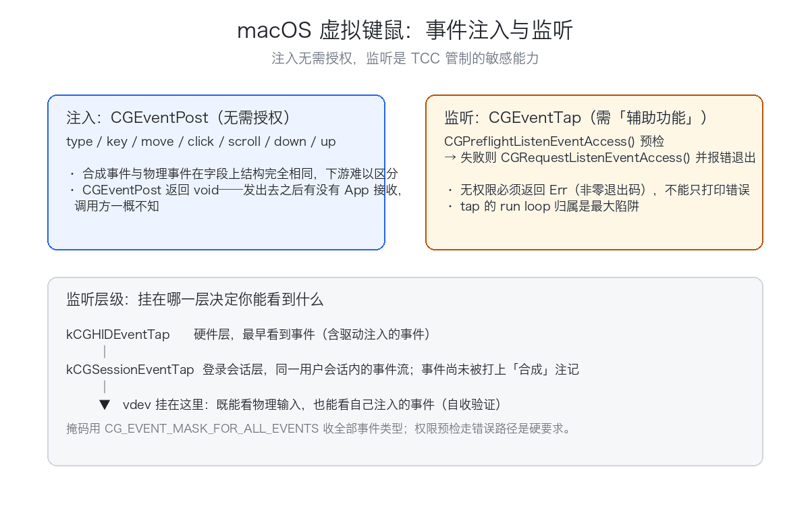

# 用 Rust 写 macOS 虚拟键盘/鼠标：CGEventPost 注入与 EventTap 监听

**CGEventPost 注入键鼠不需要任何授权，监听却是 TCC 管制的敏感能力——一薄一厚两面，vdev-hid 只用了 400 行。**

> 本文是 vdev 虚拟设备驱动开发系列之一（共 9 篇）。完整源码与代码位置标注见仓库对应文章。

## 一、为什么要"软件注入"键鼠

自动化测试要点一遍表单、远控软件要把本端的键鼠动作转发到对端、批处理脚本要替人按回车……这些场景的共同点是：**你需要让系统"以为"有人按了一下键盘、动了一下鼠标**，而不是真去插一个硬件。在 macOS 上，这类"合成输入"有三条路线：

- **CGEventPost / CGEventTap**（Quartz Event Services）** — **所在层**：纯用户态　**门槛**：公开 API，无签名要求；监听需 TCC 授权　**现状**：**现役推荐，vdev 选它**
- **IOHID 私有 API** — **所在层**：用户态（HID event system 深层）　**门槛**：无公开头文件，随系统版本变动　**现状**：能用，但不可依赖
- **kext / DriverKit 虚拟 HID** — **所在层**：内核 / 系统扩展　**门槛**：kext 在 Apple Silicon 上已死；DriverKit（dext）只支持 C++　**现状**：Karabiner-Elements 走的这条

vdev 的选择写在根 README 里：**虚拟 HID 用 CGEventPost 用户态注入**——键鼠和摄像头、声卡、虚拟屏一样，本质上不需要"驱动"，Quartz 事件服务在用户态就给了完整的合成与监听入口。代价是合成事件终究是"会话层"的：它过不了登录窗口，也进不了 Secure Input 域（见第八节）。

`vdev-hid` crate 一共只有两个源文件（`keycodes.rs` + `lib.rs`，合计约 400 行），依赖只有两个：`cgevents`（经 Swift 桥调用 CoreGraphics 的 Rust crate）与 `anyhow`。就这 400 行，实现了键码注入、文本输入、鼠标移动/点击/滚动、全局事件监听四件事。本文把它拆开讲透。

## 二、Quartz Event Services 最小知识

macOS 把所有输入事件汇成一条流，Quartz Event Services 在这条流上定义了三个可挂"tap"（观测/注入点）的位置，从上游到下游依次是：

**HID tap → session tap → annotated session tap**

- **HID tap**：最上游、最接近硬件。注入到这里的事件，对下游所有层而言与物理事件无异；
- **session tap**：登录会话层。同一用户会话内的事件流经这里，此时事件尚未被打上"合成"注记；
- **annotated session tap**：最下游。事件已被系统处理并标注（例如标明它来自其他进程的注入），常用于事件录制类工具。

`CGEventPost` 的 target 参数就是这三选一。vdev 把注入点固定在最上游：

`rust
// crates/vdev-hid/src/lib.rs:19
/// 事件注入位置：HID 会话层，全局生效。
const LOCATION: TapLocation = TapLocation::Hid;
`

后面会看到，监听侧挂的却是 session tap（第五节）。这条组合意味着：**注入的事件走 HID 上游进入事件流，流经 session 层的监听 tap 时会被自己的 listener 看到**——自发自收可用来做端到端验证。

还值得知道的一点：`CGEventPost` 的 C API 返回 `void`，注入成败系统不直接告诉你（坑 5 会回到这一点）。每个事件都自带时间戳、来源（`CGEventSource`，vdev 经 cgevents 统一用 private source 构造）与 flags 字段，合成事件与物理事件在这些字段上结构完全相同——这正是"下游无法区分"的原因。

## 三、键盘注入

### 3.1 键码不是 ASCII——kVK 虚拟键码表

macOS 键盘事件的 `keycode` 字段装的是**虚拟键码**（即 Carbon HIToolbox `Events.h` 里的 `kVK_*` 常量），编码的是**物理键位**，与 ASCII 毫无关系：

- 字母按 Home Row 排布：A=0x00、S=0x01、D=0x02、F=0x03……QWERTY 顺序但不是字母表顺序（Z=0x06、X=0x07、C=0x08、V=0x09，然后 **0x0A 是空号**，B=0x0B）；
- 数字行乱序：1=0x12、2=0x13……9=0x19，而 **0=0x1D**——比 9 还"远"，中间隔着 -（0x1B）和 =（0x18）；
- 功能键最迷惑：F1=0x7A、F2=0x78、F3=0x63、F4=0x76——完全非线性。

vdev 提供一张"键名 → 键码"表。字母与控制键复用 `cgevents::Keycode` 常量（kVK_* 的 Rust 版），数字与 F5–F12 直接抄十六进制字面量：

`rust
// crates/vdev-hid/src/keycodes.rs:39-48,66-73（节选）
"0" => 0x1D,
"1" => 0x12,
...
"f5" => 0x60,
"f6" => 0x61,
...
"f10" => 0x6D,
"f11" => 0x67,
"f12" => 0x6F,
`

表外有两道保护：`by_name` 查不到返回 `None`，CLI 报 `unknown key: … (see vdev hid key --help)`；帮助文本里的键名列表来自同一张表的 `NAMES` 常量，并有单测锁死「NAMES 里每个名字都必须能被 `by_name` 解析」以及全部别名收录——帮助信息与解析逻辑永不漂移。

注意 CLI **只收键名、不收数字键码**：`vdev hid key space` 可以，`vdev hid key 49` 不行。要发任意原始键码，得用库 API `key(keycode, pressed)`。

### 3.2 down/up 与修饰键

最底层的是 `key`：一个 `KeyEvent::down/up(keycode)` 构造出键盘事件，`post(LOCATION)` 注入了事。往上一层是点按 `tap_key`：

`rust
// crates/vdev-hid/src/lib.rs:40-51
pub fn tap_key(keycode: u16, modifiers: ModifierFlags) -> Result<> {
 KeyEvent::down(keycode)
 .with_modifiers(modifiers)
 .post(LOCATION)
 .map_err(|e| err(&e))?;
 thread::sleep(GAP);
 KeyEvent::up(keycode)
 .with_modifiers(modifiers)
 .post(LOCATION)
 .map_err(|e| err(&e))?;
 Ok()
}
`

三个细节：

1. **down 和 up 都要带 modifiers**。修饰键以 flags 形式附着在事件上（底层 `CGEventSetFlags`），只给 down 不给 up，接收方会认为修饰键还按着不放；
2. **flags 是"替换"而非"叠加"**——合成事件会整体覆盖 flags 字段，物理按住的修饰键在这一瞬间被"顶掉"。要做物理+合成组合键，得先读当前 flags 再合并（vdev 没做，它的用例不需要）；
3. **GAP = 12ms**：down 与 up 之间留一小段间隔，给接收方（尤其是跨进程的 AppKit 事件循环）留出稳定识别两个事件的时间。

修饰键解析在 CLI 侧做成了别名表：`parse_modifiers` 接受 shift/cmd/ctrl/alt 及全称，于是有了 `vdev hid key space --modifiers cmd,shift` 这样的用法。

### 3.3 文本输入：另一条 Unicode 通道

逐字符 `tap_key` 只能输入 US 键位上印得出来的字符，中文、emoji 无从下手。CGEvent 给键盘事件留了一个附属字段——Unicode string（`CGEventKeyboardSetUnicodeString`）。cgevents 的 `type_string` 就是逐字符走这条通道：

`rust
// cgevents 0.10.1（第三方依赖）, src/event/mod.rs:665-676（节选）
for ch in s.chars {
 let chunk = ch.to_string;
 let down = KeyEvent::down(0).with_unicode(&chunk).build(&source)?;
 down.post(location);
 let up = KeyEvent::up(0).with_unicode(&chunk).build(&source)?;
 up.post(location);
}
`

注意虚拟键码恒为 0，字符本体挂在 Unicode 附件里。读 `NSEvent.characters` 的常规 App 拿到的是真字符，中文照样进；但只认键码的目标（某些游戏、远程桌面客户端）会把每个字符看成一个 keycode 0 的怪键。vdev 的 `type_text`直接封装它，CLI 一行 `vdev hid type "hello from vdev"` 即可。

## 四、鼠标注入

鼠标三条命令对应三种事件构造，全部发生在：

**移动**：`MouseEvent::move_to(Point::new(x, y))` —— 一个 `MouseMoved` 类型事件。坐标是 `CGPoint`（Double），**天然支持子像素**；坐标系是全局点坐标、原点在左上（ 注释），Retina 屏上这里是"点"不是物理像素。

**点击**：先 `mouse_move` 到目标，再 `button_down` + GAP + `button_up`：

`rust
// crates/vdev-hid/src/lib.rs:66-76
pub fn mouse_click(x: f64, y: f64, button: MouseButton) -> Result<> {
 mouse_move(x, y)?;
 MouseEvent::button_down(Point::new(x, y), button)
 .post(LOCATION)
 .map_err(|e| err(&e))?;
 thread::sleep(GAP);
 MouseEvent::button_up(Point::new(x, y), button)
 .post(LOCATION)
 .map_err(|e| err(&e))?;
 Ok()
}
`

先 move 再 down 不是多余的：目标 App 的悬停状态（tooltip、hover 高亮）依赖 moved 事件先到位。按钮经 CLI 的 `parse_button` 解析，支持 left/right/middle（middle 别名 center，）。事件构造最终落在 Swift 侧的 `CGEvent(mouseEventSource:mouseType:mouseCursorPosition:mouseButton:)`——注意 vdev **没有显式设置 clickState**，即按系统默认的单击语义；要合成双击/三击，需自己给事件的 `kCGMouseEventClickState` 字段递增计数。

**滚动**：`ScrollEvent::lines(delta_y)`，`delta_y` 为正向上滚、单位是"行"。底层是 `CGEventCreateScrollWheelEvent` 的 line 单位变体；cgevents 还提供 `pixels` 系列构造器（像素精度滚动，触控板式平滑滚动场景用），vdev 的 CLI 暂未暴露。

## 五、监听侧：vdev hid listen

注入不需要任何授权，监听则相反——**全局事件监听是 TCC 管制的敏感能力**。macOS 10.15 起，系统用 `CGPreflightListenEventAccess` / `CGRequestListenEventAccess` 两个 API 表达这件事；对应系统设置里的「辅助功能」与「输入监控」两类授权。vdev 在监听入口先做预检，失败则触发一次正式请求并直接报错退出：

`rust
// crates/vdev-hid/src/lib.rs:92-98
pub fn listen(seconds: Option<u64>) -> Result<> {
 if !EventTap::preflight_listen_access {
 let _ = EventTap::request_listen_access;
 return Err(anyhow!(
 "需要「辅助功能」权限：请在 系统设置 → 隐私与安全性 → 辅助功能 中勾选当前终端，然后重试。"
 ));
 }
request_listen_access` 会引导系统弹出授权提示；注意授权对象是**运行 vdev 的终端 App**（iTerm/Terminal 等），不是 vdev 自己。权限被拒时以非零退出码结束——这对脚本化使用很关键（README 权限说明一节明确写了这一行为，`README.md:236`）。

过了权限关，创建 tap：

`rust
// crates/vdev-hid/src/lib.rs:103-107
let handle = thread::spawn(move || {
 let tap = match EventTap::new(
 TapLocation::Session,
 cgevents::CG_EVENT_MASK_FOR_ALL_EVENTS,
 |ev| { /* 分类打印 key/mouse/scroll */ TapAction::Pass },
 ) { ... };
`

三个要点：

1. **位置是 Session**，掩码是 `CG_EVENT_MASK_FOR_ALL_EVENTS`（cgevents 里就是 `u64::MAX`，全部事件类型都收）。如前所述，挂在 session 层既能看到物理输入，也能看到自己从 HID 层注入的事件；
2. **tap 类型是 Default（非 passive）**，意味着这个 tap 本可拦截甚至改写事件，但回调恒返回 `TapAction::Pass`——只观察、不吞事件。想做成按键过滤/改写工具（Karabiner 的核心能力），把 `Pass` 换成 `Drop` 或改写字段即可，架构不用动；
3. **回调输出三种格式**：键盘类（KeyDown/KeyUp/FlagsChanged）打 `[key] KeyDown code=0x31 flags=…`——修饰键单独按也会触发 FlagsChanged；鼠标类打 `[mouse] LeftMouseDown at=(x,y)`；滚轮只打 `[scroll]`。

最后是**线程归属**——这是这个函数注释里写了整整七行、也是坑 1 的主角：

`rust
// crates/vdev-hid/src/lib.rs:100-101,143-144
// 创建与运行同线程（见函数注释）；创建结果经 channel 交还主线程，
// 成功后主线程持有 Arc 句柄用于到点 stop。
...
 if tx.send(Ok(tap.clone)).is_ok {
 tap.run; // 阻塞于本线程 run loop，直到 stop 或 Ctrl-C 终止进程
 }
`

EventTap 的 run loop source 在**创建线程**的 run loop 上，`run` 也必须在同一线程调用。所以 listen 的结构是：专用线程里"创建 + 运行"，创建结果经 mpsc channel 交还主线程；主线程持有 `Arc<EventTap>`，`--seconds N` 到点后调 `tap.stop`（stop 停的是创建线程的 run loop，线程安全，）；不带超时的常驻模式则一直 `join`，Ctrl-C 直接杀进程。

## 六、踩坑实录

以下五个案例全部来自 vdev 的开发/审查过程，修复均已合入 main。

### 坑 1：EventTap 被移交给新线程，listener 永远零输出

初版 `listen` 的写法：主线程创建 EventTap，然后把 `tap.run` spawn 到新线程：

`rust
// 修复前（commit bde9358 版 lib.rs，节选）
let tap = EventTap::new(
 TapLocation::Session,
 cgevents::CG_EVENT_MASK_FOR_ALL_EVENTS,
 |ev| { /* ... */ TapAction::Pass },
)
.map_err(err)?;
println!("监听 HID 事件中（{seconds}s 后自动退出，Ctrl-C 可提前结束）…");
std::thread::spawn(move || tap.run);
std::thread::sleep(Duration::from_secs(seconds));
`

**现象**：程序正常启动、正常打印"监听中"、到点正常退出，一行事件都没有——不 panic、不报错、退出码 0，看起来一切健康。

**根因**：cgevents 的 Swift 桥在 tap 创建函数里就取了 `CFRunLoopGetCurrent`（`Support.swift:100`），并把 `CFMachPortCreateRunLoopSource` 产生的 source `CFRunLoopAddSource` 到**创建线程**的 run loop 上（`Support.swift:118`）。于是：source 挂在主线程的 run loop 上，而主线程在 `thread::sleep`，永远不转；新线程里的 `tap.run` 跑的是新线程自己的 run loop——上面没有任何 source，`CFRunLoopRun` 立即返回，`tap` 随之在 spawn 闭包结束时被 Drop 释放。事件投递目标从头到尾就没活过。

**修复**（commit e7caea0）：创建与 `run` 放进同一个专用线程，主线程只做计时和 `stop`——即第五节展示的现结构。这类"create 时隐式绑定当前 run loop"的 API（CGEventTap/CFMachPort/各类 CFRunLoopSource 封装）都适用同一铁律：**谁创建，谁 run**。

### 坑 2：权限被拒也是静默的——报错了，退出码却是 0

同一个初版里，权限预检失败走的是 `eprintln!` + `return Ok()`：错误信息打出来了，进程退出码却是 0。用 vdev 做远控链路时，上游脚本判断"listen 成功启动"，随后把注入事件发向一个根本没在监听的进程。修复后无权限时返回 `Err`，CLI 以非零码退出（现行为与 `README.md:236` 的承诺一致）。教训：**TCC 预检必须走错误路径，"打印了错误"和"返回了错误"是两回事**。

### 坑 3：键码表对照方法论——别从 ASCII 推，拿 Events.h 对

写键码表最容易犯的错是想当然：'1' 顺移成 0x01、F2 排在 F1 后面。真实情况是 3.1 节列的那堆反直觉值。vdev 的做法分三步：

1. **唯一权威是 Apple 的 kVK_* 常量**（Carbon `HIToolbox/Events.h`），字母/控制键直接用 cgevents 的 `Keycode` 常量（其值即 kVK_*），数字/标点/F5–F12 逐项抄 `Events.h` 的十六进制字面量；
2. **独立复核**：审查阶段把键码表与 kVK_* 全量对照了一遍，确认一致（审查报告原话："vdev-hid 键码表全量与 kVK_* 一致"）；
3. **单测锁一致性**：`NAMES`（帮助文本展示的键名）与 `by_name`（实际解析）之间靠 `names_all_resolve_via_by_name` 单测双向锁定——帮助列出的键必须可解析，解析支持的别名必须收录进帮助。

### 坑 4：文档漂移——README 里的命令跑不通

全仓审查时实跑 README 快速上手，7 条命令里 3 条失实：`vdev hid mouse move`（实际子命令是 `hid move`）、`vdev hid mouse click`（实为 `hid click`）、`vdev hid key 49`（key 只收键名，不收数字键码）。三处已在 commit 2385ebe 与实现对齐——现在的 README 里是 `vdev hid move 100 100`、`vdev hid key space`，并注明"键名只收名字，全表见 vdev hid key --help"（`README.md:68`）。教训与同仓库声卡篇一致：**命令文档必须逐条实跑，"看起来像"不是证据**。

### 坑 5：注入是 fire-and-forget，且唤不醒休眠的机器

两个"如实"的边界，写代码前就该知道：

- **`CGEventPost` 返回 void**（cgevents 的 Swift 侧 `cgeventPost` 同样无返回值，`CGEvent.swift:251-255`）。事件发出去之后，有没有 App 接收、有没有被安全机制丢弃，调用方一概不知。需要确认"到达"时，用第五节的监听做自收验证，而不是指望注入的返回值；
- **合成事件唤不醒已休眠/锁屏的机器**。vdev 配套的屏幕采集链路里实测过：显示器闲置休眠后 `displays` 为空，`CGEventPost` 的鼠标事件无法把机器唤醒（此时可能已无 GUI 会话可投递），`caffeinate -u`（断言用户活跃）才是正解。

## 七、构建与运行

macOS（Apple Silicon）侧整仓一个 workspace，构建后二进制名为 `vdev`（`crates/vdev-host` 的 `[[bin]]`）。以下命令与根 README 快速开始一节逐字一致（README 里 `vdev` 即 `target/release/vdev`）：

`bash
cargo build --release

# 虚拟 HID
vdev hid type "hello from vdev"
vdev hid key space # 空格（键名只收名字，全表见 vdev hid key --help）
vdev hid move 100 100
vdev hid click 100 100 --button left

# 监听键盘/鼠标（需要辅助功能权限；无权限时立即报错、以非零退出码退出）
vdev hid listen --seconds 10
`

补充几个 README 没列全、代码里有的子命令（均来自 的 `HidCmd` 定义）：

`bash
vdev hid key space --modifiers cmd,shift # 组合键（shift/cmd/ctrl/alt 及全称）
vdev hid down space # 按住（配合 up 模拟长按）
vdev hid up space
vdev hid scroll 3 # 滚轮，正数向上（行单位）
vdev hid click 100 100 --button right # left / right / middle
`

权限三态：注入（type/key/move/click/scroll/down/up）不需要任何授权，直接可用；监听（listen）需要「辅助功能」，无权限时报错并以非零码退出，按提示在 系统设置 → 隐私与安全性 → 辅助功能 勾选你的终端后重试。

## 八、现状与局限

如实交代，不含糊：

- **键名表只有 US QWERTY 范围**：26 字母、10 数字、11 个标点、F1–F12、控制键与方向键（`keycodes.rs` 全部内容）。多媒体键、Fn、非美式布局键位未收录；要发这些键码得直接调库 API `key(u16, bool)`；
- **文本输入依赖 Unicode 通道**：`type` 对读 `NSEvent.characters` 的常规 App 无往不利，但对只认虚拟键码的目标（部分游戏、远程桌面）会失效，此时改用 `key --modifiers` 逐键合成；
- **点击是"单击"语义**：clickState 未显式设置，双击/拖拽（按住移动）需要自己组合 down/move/up 或改写 clickState，CLI 暂无对应子命令；
- **监听输出是调试级的**：滚轮事件只打 `[scroll]` 不带 delta；tap 恒为 Pass，未暴露拦截/改写（架构上已具备）；
- **listen 的 CLI 只有定时模式**（`--seconds`，默认 10）。库 API `listen(None)` 支持常驻，但 CLI 未接（ 有注释说明）；
- **合成事件的天花板**：过不了登录窗口与 Secure Input 域，唤不醒已休眠的机器（坑 5），锁屏状态下行为取决于会话状态。这些是 Quartz 用户态路线的固有边界，不是 bug；
- **macOS 版本**：权限预检 API 是 10.15+ 的（cgevents 内部有 `#available` 分支，更老的系统直接跳过检查）；vdev 实测环境为 macOS 26。

## 九、写在最后

`vdev-hid` 是整个 vdev 里最"薄"的一个虚拟设备：400 行、一个依赖、零签名零安装，却是四件事里离"每个 macOS 开发者都用得上"最近的——自动化测试、CI 里的 UI 冒烟、远控转发，起点都是 `CGEventPost` 这一个函数。它也把虚拟设备系列的核心思路演得最直白：**先找操作系统在用户态留的正门，找不到才考虑驱动**。

想继续深入的话：往"改写"方向走，把 listen 的 `TapAction::Pass` 换成改写逻辑，就是一个小 Karabiner（按键映射器）的骨架；往"真硬件级"方向走，Windows 侧的 `vdev-hid-win` 提供了对照——KMDF 内核 HID minidriver，从 HIDCLASS 层把虚拟设备注册成系统真件，系列另有专文。仓库里各路线的选型笔记见 `docs/dev/macos-route-ideas.md`，全套文章索引见 vdev 仓库。

如果本文帮到了你，欢迎到 vdev 仓库 点个 star，或在 issue 里聊聊你想看的下一篇。

---

**关于 vdev**：一个用 Rust 造虚拟设备的开源项目（摄像头 / 显示器 / 声卡 / HID，macOS + Windows 双栈），本系列共 9 篇，全部基于仓库真实代码与真实排障记录。

- 项目地址：**github.com/gqf2008/vdev**（点击文末"阅读原文"）
- 系列总目录与其余篇目：仓库 `docs/community/`

如果这篇帮你少踩一个坑，欢迎到仓库点个 star。
