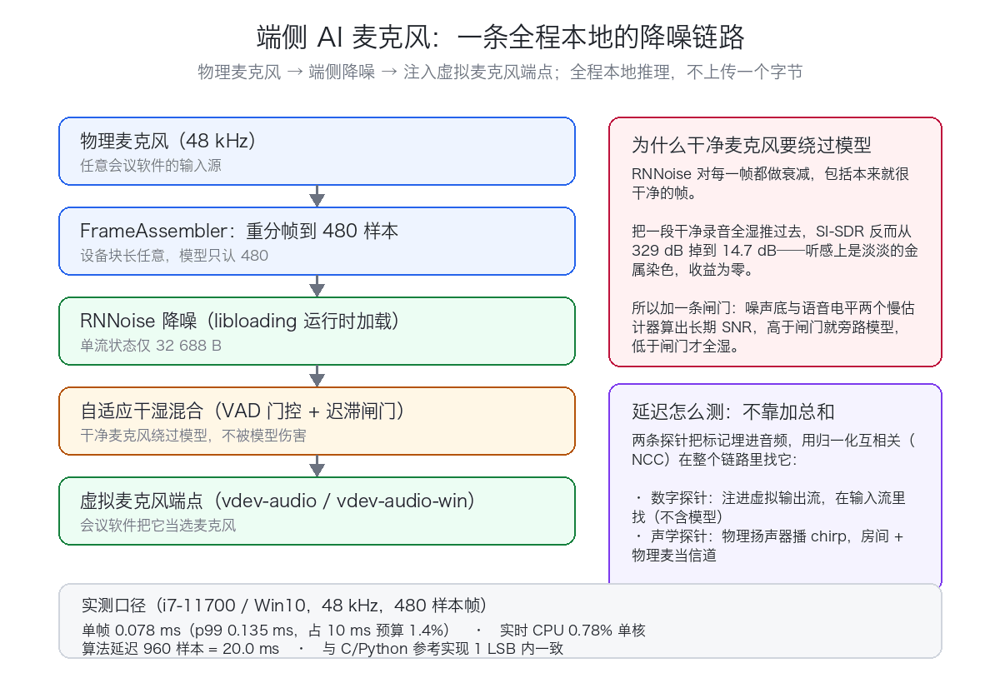

# 给会议软件一支 AI 麦克风：vdev-mic-agent 端侧降噪链路拆解

**这条 AI 麦克风链里没有一行新驱动**——它只是操作系统音频栈的又一个普通客户端，却把端侧降噪、自适应干湿与端到端延迟测量都钉死在了可复现的数字上。

> 本文是 vdev 虚拟设备驱动开发系列之一（共 9 篇）。完整源码与代码位置标注见仓库对应文章。

## 一、引言：开会时，那支"AI 麦克风"背后发生了什么

你在会议软件里把麦克风切成"AI 降噪"，对方瞬间听不到你敲键盘的声音。这背后是一条实时链路：物理麦克风采集 → 端侧神经网络降噪 → 送进会议软件。商业产品通常把整条链塞进一个内核级或系统级组件里；而 vdev 的思路是拆开——虚拟麦克风端点已经由 `vdev-audio` HAL 插件提供了（见系列前作《用 100% Rust 写 macOS 虚拟声卡》），缺的只是喂饱它的那条 AI 链。

刚合入 main 的 `vdev-mic-agent` 补的就是这半条链：**物理麦克风 → 端侧降噪 → 注入虚拟麦克风端点**，全部用 Rust 写在用户态。它不新增任何驱动——agent 只是操作系统音频栈的另一个普通客户端，对系统来说和 Zoom 自己读麦克风没有区别。降噪引擎选了 RNNoise：单流 RNN 状态仅 32 688 字节，实测 0.78% 单核就能跑实时（数据见第四节）；更好的 DeepFilterNet3 约是它 9 倍的 CPU，档位分层留作产品决策。

这个 crate 是同一方案 C/Python 参考实现的 Rust 孪生版：同一条 DLL、同一个帧循环、同一套预热流程，产出与参考实现**逐采样一致**的音频（100% 采样误差 ≤ 1 LSB）。换句话说，先把算法在离线口径下钉死，再把它搬进实时回调——这也是理解整个仓库结构的钥匙。

**平台怎么切分**：这是一份**跨平台的单篇**，因为只有一套实现——`mixer.rs` / `frames.rs` / `latency.rs` / `ring.rs` 这些 DSP 与工程核心是平台无关的，macOS 与 Windows 只在**接线层**不同（CoreAudio 回调 vs WASAPI 轮询 + 内核环回，见第七节）。所以本文不按平台分成两篇：若真按平台切，两篇会共享同样的算法章节、各剩半篇平台专属内容。等 Windows 侧的真机实测数据攒够（loopback、padding 对齐、声学探针实测量），再把那一节升级成独立一篇才划算——现在不是。

## 二、架构与数据流：D1–D4 四个里程碑

整条链路一图流（摘自 `crates/vdev-mic-agent/src/platform/macos.rs` 模块注释，有删节）：

`text
physical mic ──▶ AudioUnit(HALOutput) ──▶ FrameAssembler(480 重分帧)
 │
 RNNoise + 自适应干湿混合
 │
 [SPSC ring, 无锁]
 │
 "vdev-audio A" ◀── AudioDeviceIOProc ◀──┘
 │
 └─ HAL 插件输出环回输入 ──▶ Zoom/微信把它当麦克风
`

项目按 D1–D4 四个里程碑推进，每一级只回答固定的问题：

- **D1–D2（离线）**：采集与注入都接 WAV 文件，`run`/`bench`/`diff` 三个子命令回答"降噪要多少 CPU、算法延迟多少毫秒"。这是 `agent.rs` 的帧循环：480 样本进、480 样本出，逐帧计时。
- **D3–D4（实时）**：同一个 `rnnoise` + `mixer` 核心改由真实 CoreAudio 回调驱动，`live` 子命令回答 WAV 回答不了的问题——**缓冲与调度**。设备缓冲区默认 512 帧（vdev 设备），野外的设备 128–1024 且运行中可变，而模型只认 480 样本，中间靠纯重分帧的 `FrameAssembler` 衔接（本身零延迟）。

为什么模型跑在采集回调里，而不是单独开一个降噪线程？实测单帧 0.08 ms，只占 10 ms 预算的 0.8%，内联执行省掉一整条"环缓冲 + 线程"的延迟与复杂度；采集回调与注入 IOProc 之间的交接用一个无锁 SPSC 环完成。四段代码各司其职：`ring.rs` 是交接环，`frames.rs` 是任意块长到 480 样本的重分帧加干路延迟线，`latency.rs` 是端到端延迟探针，`platform/macos.rs` 是 CoreAudio 后端。`main.rs` 的四个子命令 `run`/`bench`/`diff`/`live` 分别对应离线单文件、离线矩阵、跨实现比对与实时链路。

还有一个容易忽略的细节：干湿混合必须做**延迟补偿**。RNNoise 是因果的但不是零延迟——输出落后输入整整 2 帧（960 样本，20 ms）。把模型输出和未延迟的干信号直接混音会造出梳状滤波器：在 +30 dB 信噪比 case 上，不做补偿的 50/50 混合 SI-SDR 崩到 −7.7 dB，比单独用任何一个信号都差得多（数据见 crate README）。所以只要 `mix < 1` 或自适应闸门可能回落，干路就先过一条 960 样本的延迟线（`frames::DelayLine`，流式版必须与离线的 Vec 平移逐采样一致，单测有断言）再混合。

## 三、关键机制解析

### 3.1 无锁 SPSC 环：重试写与丢帧分开计数

音频回调跑在 `coreaudiod` 的实时线程上：不能分配内存、不能阻塞、不能拿会争用的锁。采集侧与注入侧的交接因此是一个固定容量、启动时一次分配的 SPSC 环（`ring.rs`）。容量向上取整到 2 的幂，用掩码代替取模；`head`/`tail` 两个单调递增的 `AtomicUsize` 各归一边，配合 Acquire/Release 对保证"先写数据、后发布下标"的可见性，回绕用 `wrapping_sub` 处理：

`rust
// crates/vdev-mic-agent/src/ring.rs（SpscRing::push）
pub fn push(&self, data: &[f32]) -> usize {
 let head = self.head.load(Ordering::Relaxed);
 let tail = self.tail.load(Ordering::Acquire);
 let free = self.capacity - head.wrapping_sub(tail);
 let n = data.len.min(free);
 for (i, &v) in data[..n].iter.enumerate {
 let slot = (head.wrapping_add(i)) & self.mask;
 unsafe { *self.buf[slot].get = v }; // 生产者独占的自由区
 }
 self.head.store(head.wrapping_add(n), Ordering::Release);
 n
}
`

真正有讲究的是实时语义的两套拼写。`push`/`pop` 写（读）多少算多少，剩下交给调用方回头重试——喂线程和测试用，故障计数保持干净；`push_or_drop`/`pop_or_silence` 是回调专用：装不下就丢、缺了就补零，但**分别计入 overruns 与 underruns**。这两个计数器就是运行报告里"我们丢了音频"和"我们放了静音"的区分依据——都是故障，但根因一个在生产侧一个在消费侧。测试里有一针见血的一条：同样的环状态，重试式短写不计丢帧，实时拼写就计。

### 3.2 VAD 门控自适应干湿：让干净的麦克风保持干净

RNNoise 对**每一帧**都做衰减，包括本来就很干净的帧。把一段完全干净的录音全湿推过去，SI-SDR 反而从 329 dB 掉到 14.7 dB，听感是淡淡的金属染色——收益为零，纯亏。`mixer.rs` 的自适应闸门就是为此而生，策略是"两个慢估计器 + 一个迟滞闸门"：

1. **噪声底**：只用手头 VAD 概率低于 0.30 的非语音帧更新，且"跌得快、涨得慢"（`floor_fall` 0.50 对 `floor_rise` 0.01）的最小值统计跟踪器——长句子永远抬不高噪声底；
2. **语音电平**：只对语音帧做一阶平滑（系数 0.02）。

两者相除得到长期 SNR，送进 25 dB 中心、±2 dB 迟滞、10 dB 线性斜坡的闸门：高于闸门旁路模型（`min_wet` = 0），低于"闸门 − 斜坡"全湿（`max_wet` = 1），wet 比值本身再用不对称的一阶系数（attack 0.20 / release 0.01）平滑。时间尺度按估计器分层：快的一侧是噪声底跌落（`floor_fall` 0.50，约十几毫秒）与 wet 上升（attack 0.20，约 45~50 ms），慢的一侧是噪声底抬升（`floor_rise` 0.01）、语音电平平滑（0.02）与 wet 回落（release 0.01），后三者才到数百毫秒至秒级。这种不对称是刻意的——逐帧 SNR 会在每个 10 ms 边界上翻转增益，听感上是可闻的抽吸；要回答的是"这个房间吵不吵"，那是房间的属性，不是帧的属性。

`rust
// crates/vdev-mic-agent/src/mixer.rs（AdaptiveMixer::update 内）
let gate = if self.wet < 0.5 {
 c.gate_db - c.hysteresis_db // 干态低门槛 23 dB：进湿更难
} else {
 c.gate_db + c.hysteresis_db // 湿态高门槛 27 dB：出湿更难
};
let target = if snr_db >= gate {
 c.min_wet // 干净：旁路模型
} else if snr_db <= gate - c.ramp_db {
 c.max_wet // 嘈杂：全湿
} else {
 let t = (gate - snr_db) / c.ramp_db; // 线性斜坡
 c.min_wet + t * (c.max_wet - c.min_wet)
};
`

实测这张表（crate README，i7-11700/Win10）是闸门的身份证：干净参考输入下全湿 14.72 dB，自适应 30.57 dB（wet 0.06）；+30 dB 输入 26.29 dB（wet 0.13）；而 +5 dB 及以下的嘈杂输入，闸门维持全湿、不打折——**它从不拖累嘈杂的麦克风，也阻止模型伤害干净的麦克风**。

### 3.3 chirp + 归一化互相关：双探针测端到端延迟

"开会有没有延迟感"没法靠把数据手册的缓冲区大小加起来回答——那忽略了调度、插件内部的环，而声学场景里物理设备的输入输出流甚至不在同一个采样时钟上。诚实的做法是把标记埋进音频里，用归一化互相关（NCC）在整个图里找它。

标记是一段 480 样本、1–4 kHz 线性 chirp 加 Hann 窗，归一化到 0.5 满幅：不用脉冲是因为频谱平坦、会顶限幅器；chirp 把能量集中在语音频段，能穿过模型/链路的谱处理，自相关仍是单尖峰。检测器用前缀和维护窗口能量，复杂度 O(n·m)、无 FFT 依赖，先做一个 −60 dBFS 的幅度门再算相关，静音期省掉绝大部分计算。

两条探针回答两个问题：

- **数字探针**（`live --probe digital`）：把标记注进虚拟设备的输出流，在同一设备的输入流（HAL 插件环回）里找它。测的是"注入 → 播放缓冲 → 插件环 → 采集缓冲 → 消费者"，不需要麦克风和安静房间，可以进 CI。它不含模型——这条路径上引擎根本不加载——所以报端到端时要另加 20 ms 模型前瞻。
- **声学探针**（`live --probe acoustic`）：物理扬声器播标记，房间和物理麦克风当信道，到虚拟麦克风里找。这是参会者**体感**的那个数：加上物理麦自己的缓冲、ADC/DAC 与约 1 ms（34 cm）的空气传播。此模式下模型被旁路，但干路延迟线保留——960 样本延迟线顶替模型的 20 ms，保证计时口径不变，而标记不会被模型当噪声吃掉。

两条探针用同一个标记和同一个检测器（阈值不同：数字环回逐位一致用 0.60，声学信道有衰减用 0.35），所以两数直接可比，差值恰好是采集链。还有一个容易被审漏的点：`LatencyProbe` 记的是 `Instant` 墙钟而不是各设备的采样时钟——物理输出设备与虚拟麦克风是两台设备、两个独立时钟，它们的采样计数根本不可比；`Instant` 是唯一两边共享的单调钟。

### 3.4 引擎前瞻与缓冲预算：20 ms + 10 ms 的口径

延迟预算要分开两笔账。**算法账**：RNNoise 的前瞻固定 2 帧 = 960 样本 = 20.0 ms（互相关实测，不是拍脑袋），干路延迟线是补偿不是新增——它把干信号对齐到模型前瞻，混合输出不会更慢。**缓冲账**：设备缓冲默认 512 帧 @48 kHz（约 10.7 ms），`FrameAssembler` 是纯重分帧、贡献 0 样本延迟，插件侧的环由数字探针实测。合起来，项目的口径从早期"端到端 < 20 ms"修订为**"算法 20 ms + 缓冲约 11 ms"**——前者是模型的物理下界，后者才是工程上要压的数。

## 四、实测数据

以下数据引自 crate README（环境：i7-11700，Windows 10，48 kHz，480 样本帧，每 case 1806 帧；只计降噪调用本身的逐帧墙钟）：

- **单帧耗时 avg / p50** — 0.078 ms / 0.073 ms
- **单帧耗时 p95 / p99 / max** — ~0.11 ms / 0.135 ms / 0.18 ms
- **10 ms 帧预算占用（p99）** — ~1.4%
- **RTF（实时因子）** — 0.0081
- **跑实时所需 CPU** — **单核的 0.78%**
- **单核可带实时流数** — ~128
- **RNN 单流状态** — 32 688 B
- **算法延迟（互相关实测）** — 960 样本 = 20.0 ms

降噪质量（SI-SDR，对干净参考）：干净输入全湿 14.72 dB → 自适应闸门 **30.57 dB**；+30 dB 输入 14.14 dB → 26.29 dB；+10 dB 11.04 → 11.57 dB；+5 dB 与 0 dB 闸门维持全湿（7.79 / 2.49 dB），不牺牲嘈杂场景。干湿混合不做延迟补偿的代价同样触目：50/50 无补偿 −7.7 dB，补偿后纯旁路 26.29 dB。

与 C/Python 参考实现的逐采样比对（18.06 s 文件，866 880 样本）：bit-exact 49.91%，**1 LSB 内 100%**，平均误差 0.5009 LSB，最大 1.0 LSB。那 0.5 LSB 的均值纯属浮点转 int16 的舍入方向差异（libsndfile 与 `hound`+`round` 对正半值处理不同），DSP 本身完全一致。另注明：逐帧 CPU 占比一列在 macOS 上印 `n/a`——`cpu_seconds` 目前是 `GetProcessTimes` 的 Windows 实现，macOS 返回 0.0，与其印出无意义的 0%，不如如实说没测（离线 `run`/`bench` 与 `live` 报告都按这一口径处理）。

## 五、踩坑实录

合入前的独立审查（提交 `49e3547`，3 blocker + 6 major + 卫生批全清）留下了几个教科书级案例，全部有一个共同点：**编译过、单测绿、跑起来静默错**。

**坑 1：每样本状态机"先自增后判 ==0"，打点分支永不可达。** 声学探针原来的播放回调里，位置变量先 `pos += 1` 再判 `pos == 0` 打时间戳——判定永远为假，标记间隔计数器又不参与选路，标记背靠背连播，延迟测量必然 0 检出。27 项单测全绿照样漏：逐帧数值断言型单测只覆盖"单个状态下的输出值"，不覆盖"事件顺序"；而 platform 层的 FFI 回调状态机恰恰是单测最难触达的地方。修复把标记发射器写成一个无状态依赖的纯推进函数 `MarkerEmitter::next`（每次调用吐一个样本并报告"本样本是否为标记起点"），遵循"先判定/打点、后自增/推进"的书写顺序；渲染侧另有一个纯函数 `SpeakerCtx::next`（返回 `(样本, Option<Instant>)`，在首样本取墙钟）。回归测试逐样本驱动这些纯函数——不是把假 buffer 喂给 FFI 回调——断言打点次数、位置与静音期长度：

`rust
// crates/vdev-mic-agent/src/platform/macos.rs（MarkerEmitter::next，修复后）
let v = self.marker[self.pos];
let started = self.pos == 0; // 打点判定在前
self.pos += 1; // 状态推进在后
if self.pos == self.marker.len {
 self.until_next = self.period_frames; // 静音期不得短于标记本身
}
(v, started)
`

**坑 2：迟滞方向写反，注释与代码相反就是红旗。** `mixer.rs` 注释写"进湿的门槛更高"，代码却把干态闸门取 `+hysteresis_db`（进湿更容易）、湿态取 `−hysteresis_db`（离开更容易）——方向与设计意图相反，25 dB 迟滞退化成无死区的单一闸门，恒定 SNR 下产生极限环。注释对、代码错，说明意图与实现脱节且从无人验证。修复后代码与注释逐字对齐（见 3.2 节代码），并补两条**方向性性质测试**：恒定输入 SNR 下 wet 必须收敛到常量（有极限环即红）；两个初态（干起/湿起）在带内的稳态必须不同（迟滞宽度存在性）。第二条还做了阳性对照——旧实现在新测试下必红。

**坑 3：dlopen 句柄与裸函数指针的所有权脱节，drop 即 UAF。** `Engine` 持有 `Library` 并解析出 `process`/`destroy` 裸指针，`Denoiser` 只拷指针不引用库——`Engine` 一 drop 就 `dlclose`，之后再调 `Denoiser::process` 就是对已卸载代码的调用。单测不 drop `Engine` 所以全绿，真实进程里是延时崩溃。修复是让函数指针的使用者共享库句柄所有权：

`rust
// crates/vdev-mic-agent/src/rnnoise.rs（Engine::denoiser）
Ok(Denoiser {
 st,
 process: self.process,
 destroy: self.destroy,
 frame_size: self.frame_size,
 out: vec![0.0f32; self.frame_size],
 _lib: Arc::clone(&self._lib), // 库生命周期由每个 Denoiser 共同持有
})
`

**坑 4：实时回调路径的分配与无界增长。** `LatencyProbe::record` 在音频回调里向无界 `Vec` push，常驻运行时上限不可控——修复为 4096 样本硬上限加 `overflowed` 计数（统计口径如实描述前 4096 次检出）；NCC 的前缀和 scratch 改为调用方持有、`clear` 复用容量，命中路径零重分配；渲染侧 staging 全部启动时预分配。同批还有两条回调纪律：三个 `extern "C"` 回调体都包 `catch_unwind(AssertUnwindSafe(..))`，panic 不能穿 C 栈（默认直接 abort 整个进程），改为去抖一次日志并返回自定义四字码 `'!pnc'`；注入回调的上下文 `Box` 用 `Box::leak` 显式泄漏——`AudioDeviceStart` 之后若主循环 panic（比如 stdout 断管），栈上 Box 随 unwind 被 drop 而 IOProc 可能仍被 HAL 持有，是退出期 use-after-free，进程即退，泄漏严格更优。代码里那句注释值得抄给每个写 FFI 回调的人：**"LEAK BY DESIGN (do not 'fix')"**。

**坑 5：24-bit PCM 双重缩放，静默丢 48 dB。** 24-bit 读取写成 `(v/256.0)/(1<<(24-16))`，两段各自"看起来对"的换算叠出错误的量纲：满幅 8388607 被读成 128 而不是 32767，动态范围静默丢 48 dB，无任何报错。修复为单次除法 `v / (1 << (bits-16))`，并补满幅已知值回归测试（8388607 → 32767±1）——位深换算测试必须用满幅值，普通小值测不出缩放倍数的错。

这五个坑有一条共同的根因线：**类型系统与逐值单测都触不到"顺序、方向、生命周期、量纲"这类序列级/路径级性质**。对策不是堆更多数值断言，而是把对应性质写成测试：状态机模拟序列、闸门收敛极限、句柄生命周期绑定、缓冲上限、满幅锚定。

## 六、构建与运行

`bash
cargo test -p vdev-mic-agent # 单元测试（metrics/mixer/ring/frames/latency/stats/wavio）

# 离线：单文件降噪 + 指标
cargo run -p vdev-mic-agent --release -- run noisy_snr5db.wav \
 --out /tmp/clean.wav --reference clean_ref.wav --stats /tmp/report.json

# 自适应闸门；bench 跑整个 D1-D2 矩阵；diff 比对两份渲染
cargo run -p vdev-mic-agent --release -- run noisy_snr30db.wav --adaptive
cargo run -p vdev-mic-agent --release -- bench --dir <demo>/audio --out results_rust.json
cargo run -p vdev-mic-agent --release -- diff a.wav b.wav
live` 是 D3–D4 实时路径，有 macOS 与 Windows 两个后端（Windows 见第七节），其他平台会明确打印原因退出而不是假装能跑；macOS 侧需要先装好驱动（`make -C crates/vdev-audio install`）：

`bash
target/release/vdev-mic-agent live --adaptive --seconds 20 \
 --record-in /tmp/heard.wav --record-out /tmp/sent.wav --report /tmp/live.json
target/release/vdev-mic-agent live --probe digital --seconds 30 --report /tmp/digital.json
target/release/vdev-mic-agent live --probe acoustic --seconds 30 --report /tmp/acoustic.json
`

关于 `librnnoise`：它通过 `libloading` **运行时**加载、从不参与链接——不是为了让程序缺库也能跑（所有降噪路径缺库即报错退出，唯一例外是不需要后端的 `--probe digital`），而是打包上的取舍：现成的 MinGW 构建 `librnnoise-0.dll` 配 GNU 导入库，MSVC 链接器吃不下，让用户自己用 dlltool 重造 `.lib` 是零收益的负担。解析顺序：显式 `--dll <path>` → 存在且非空的 `$RNNOISE_DLL` → 从可执行文件所在目录起向上最多 5 级祖先目录，**每一级先查该祖先目录本身、再查其下的若干 vendored 子路径**（`third_party/native/`、`third_party/` 等；workspace 构建时命中 `crates/vdev-mic-agent/third_party/native/`）→ 当前目录；候选名覆盖 `librnnoise-0.dll`/`rnnoise.dll`/`librnnoise.dll`/`librnnoise.dylib`。该目录是 git-ignored 的，库可从 xiph/rnnoise 项目自建，或直接取 MSYS2 `ucrt64` 包（archive 仓库的 `third_party/FETCH.md` 有精确步骤）。加载时会校验 `rnnoise_get_frame_size` 必须 == 480，否则拒绝启动——platform 层的缓冲与重分帧都按 480 硬编码，错的帧长意味着越界或流失步。

## 七、Windows 通路：WASAPI 轮询 + 内核环回，驱动零改动

Windows 没有等价的 CoreAudio 回调模型，这条路换成 **WASAPI**：物理麦克风走 shared 模式采集，DSP 照旧，产物写入 `vdev-audio-win` 虚拟声卡的**渲染端点**——驱动的 render pin 在内核里环回给自己的 capture pin（见系列《Windows 虚拟声卡》篇），会议软件把「vdev 麦克风」选成输入，听到的就是降噪后的声音。agent 依旧只是音频 API 的一个普通客户端，对系统来说和 Zoom 自己读麦克风没有区别，驱动零改动：

`text
physical mic ──▶ WASAPI shared capture ──▶ FrameAssembler ──▶ RNNoise + 自适应干湿
 （48 kHz mix format） （同一 DSP 核心） │
 [SPSC ring, 无锁]
 ▼
 vdev-audio-win 渲染端点 ◀── WASAPI render（轮询补满）◀──┘
 │ 驱动内核环回：render pin → capture pin
 └──▶ 会议软件当麦克风选它 / WASAPI loopback capture（探针检测）
`

与 macOS 最大的差异是**调度模型**：CoreAudio 是 HAL 实时线程回调驱动，Windows 这里是**单线程轮询**——`timeBeginPeriod(1)` 把定时器精度抬到 1 ms，每 2 ms 醒一次，用 `GetCurrentPadding` 对齐补满 40 ms 的端点缓冲，队列深度（也就是注入延迟）因此恒定不漂。选轮询而不是事件驱动，理由写在 `platform/windows.rs` 的模块注释里：数字探针的采集端是 WASAPI **loopback capture**（`AUDCLNT_STREAMFLAGS_LOOPBACK` 挂在渲染端点上，按微软的环回契约用渲染端点的 mix format 初始化），而 loopback 流拿不到可靠的缓冲事件——没有渲染活动时缓冲里没有包、事件不触发；与其给每种流配一套事件管线，不如统一轮询一条路径覆盖 live 与双探针。轮询线程不是硬实时回调，允许分配（如 `to_mono` 每包一次），这是有意的取舍。

其余差异都是这条调度模型的推论：

- **Marker 时间戳**：macOS 在渲染回调里打点（队列深度为 0）；Windows 写入时记 `now + (pending 帧数 + marker 在本次写入块内的样本偏移) × 帧时长`——不只算队列深度，还要加上标记落在块内第几个样本，才是这段音频真实到达扬声器的时刻；渲染队列延迟计入探针报告的 `interpretation` 说明。
- **pending 队列**：macOS 双回调共享、要 `Arc<Mutex>`；Windows 单线程轮询，裸 `VecDeque` 就够。
- **`injected` 计数**：macOS 报告恒为 0（`mark_injected` 从未被调）；Windows 实际累计每个 marker 的启动数。
- **采样率门**：macOS 由 AUHAL 把客户端格式转成 48 kHz；WASAPI shared 引擎**只混音不重采样**，mix format 采样率跟着端点默认格式走。所以 `check_mix_format` 对非 48 kHz / 非 32-bit float 的端点显式报错，并给出可行动的修复（控制面板把该设备默认格式改成 48000 Hz，或 `--input`/`--vdev` 换端点）——宁可拒绝也不塞进一个没验证过的重采样器。
- **vdev 默认名**：macOS 默认匹配 `vdev-audio-A-device`；Windows 上 INF 的端点实名是「vdev 扬声器」/「vdev 麦克风」，该默认值自动重映射为 `vdev` 子串去匹配，显式 `--vdev` 则原样使用；端点缺失时报错附驱动安装提示与已装端点列表。

探针支持矩阵（标记与检测器与 macOS 完全同款，阈值同样数字 0.60 / 声学 0.35）：

- **digital** — **Windows**：✅ 实现　**机制**：loopback capture 挂在 vdev 渲染端点；`MarkerEmitter` 直接驱动渲染写入，环回流经 NCC 检测；无麦克风、无模型
- **acoustic** — **Windows**：✅ 实现　**机制**：物理扬声器 `SpeakerSource` 出 chirp → 房间 → 物理麦 → 管道（mix=0 + 延迟线顶替模型 20 ms）→ vdev 渲染 → 同一 loopback 检测

前置依赖：`vdev-audio-win` 驱动已装机（PortCls/WaveRT 内核驱动，需测试签名或正式签名，见系列《Windows 虚拟声卡》篇与仓库根 README 的签名节）；`librnnoise` 运行时加载规则与 macOS 相同；各端点默认格式 48 kHz。不想装驱动的备选路线：任何「输出环回输入」的虚拟声卡都能顶替 vdev——`--vdev` 传它渲染端点的名字串即可（如 VB-Cable 的 `CABLE Input`，会议软件把 `CABLE Output` 当麦克风），对 agent 来说只是换了个端点名字。

构建与门禁（macOS 宿主交叉检查 Windows 目标，或 Windows 宿主直接构建，CI 已有 windows-latest 原生 job）：

`bash
cargo check -p vdev-mic-agent --target x86_64-pc-windows-msvc
cargo clippy -p vdev-mic-agent --all-targets --target x86_64-pc-windows-msvc -- -D warnings
# Windows 宿主上另有 5 项 cfg(windows) 单测，仅在 Windows 编译运行：
cargo test -p vdev-mic-agent
`

**状态如实说：编译与全部门禁已绿（fmt / check / clippy -D warnings 交叉 Windows 目标，macOS 侧 check + 41 项单测），但运行时音频行为——loopback 数据流、padding 对齐、声学探针——尚未在真实 Windows + vdev-audio-win 机器上验证；驱动侧装机由项目作者在真机验证。** Windows 侧数字正确性由那 5 项单测覆盖（marker 周期与起始、pending 配对、搜索窗口封顶、声学源语义）。

## 八、现状与局限

如实说：**这个 crate 编译通过、单元测试在 Windows 与 macOS 上全绿（本文写作时 macOS 实跑 41 项通过，另有 5 项 Windows 后端单测仅随 Windows 目标编译）；macOS live 已可用，Windows live 门禁已绿；其依赖的 `vdev-audio-win` 环回驱动已真机验证（注入 0.5 幅度正弦 → 采回 RMS −6.0 dBFS），mic-agent 自身的 Windows live 行为待实测。** macOS 侧还欠的是探针的真机数字：数字探针的期望值是"设备缓冲 + 插件环"，量出来接近即算通过；Windows 侧需要装了 `vdev-audio-win`（测试签名）的真机确认 loopback 与 padding 行为；两条探针都需要真实设备才有意义。平台支持面是：离线 `run`/`bench`/`diff` 跨平台可用，`live` 及双探针 macOS + Windows 双后端（Windows 门禁绿；驱动侧已真机验证，mic-agent 侧待实测，见第七节）；`cpu_seconds` 是 Windows 实现，macOS 的 CPU 列印 `n/a`（离线与 `live` 报告同口径）。已知的"特性级"限制：纯静音参考 WAV 会得到 `segSNR = NaN`，JSON 无法表示，`run --reference`/`bench` 以序列化错误退出——这是预期行为（对数字静音谈 SNR 无意义）；CPU 时间未接 `task_info`/`clock_gettime` 前，macOS 的单核占比与"每核流数"两列缺位。Windows 侧还有三条 v1 边界：无重采样（端点默认格式非 48 kHz 直接拒绝并给出修复指引）、无设备热拔插/格式变化恢复（运行中拔设备以带上下文的错误退出）、只走 shared + 轮询（无独占模式与事件驱动，40 ms 端点缓冲是延迟与抖动免疫的折中，计入探针 `interpretation`）。

往前看还有四件事：双平台探针的真机延迟实测；AEC（本方案没有扬声器回传路径，真正的免提场景需要虚拟扬声器提供的远端参考，排二期，可复用 vox-seat）；引擎分层（DeepFilterNet3 约 9 倍 CPU 换明显更好的音质，档位是产品决策不是代码决策）；以及主观盲听 A/B——目前所有数字都是客观指标，欠听众一个裁决。

## 九、写在最后

vdev 系列此前的每一篇都在回答"怎么用 Rust 造一个虚拟设备"；这一篇回答的是它的下一问："造出来之后，往里面喂什么。"答案是：喂一条结构上和产品形态完全一致的端侧 AI 链——离线阶段就把算法、指标、跨实现一致性钉死，实时阶段只解决文件回答不了的缓冲、调度与实时纪律。等 D3–D4 的真机数字出来，"算法 20 ms + 缓冲约 11 ms"这行口径就会被两条探针的实测值检验或修正。

方案文档、原始测量数据与 A/B 音频在 archive 仓库 `vdev-ai-virtual-mic-2026-09` 目录，上游 issue 是 gqf2008/vdev#10。如果你在做会议、推流或语音 Agent，欢迎在 issue 区聊聊你的延迟预算与降噪档位需求。

---

**关于 vdev**：一个用 Rust 造虚拟设备的开源项目（摄像头 / 显示器 / 声卡 / HID，macOS + Windows 双栈），本系列共 9 篇。本篇是系列里唯一不碰驱动的一篇——它回答的是"设备造好之后，往里面喂什么"。

- 项目地址：**github.com/gqf2008/vdev**（点击文末"阅读原文"）
- 本文源码：`crates/vdev-mic-agent`

如果这条链路对你有用，欢迎到仓库点个 star。
